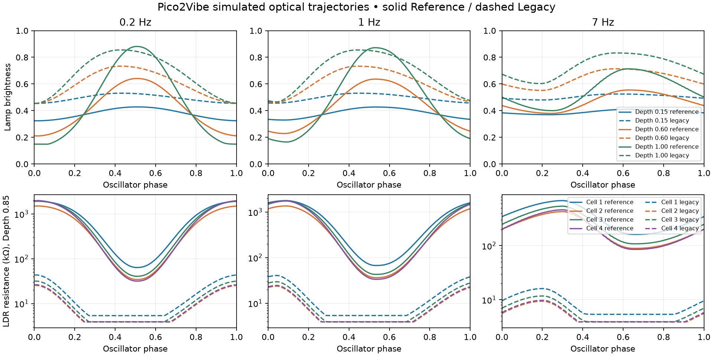

# Pico2Vibe M2.1 — absolute optical calibration and reference topology

Base: PR #34, `252063c9f1d4152b2ce276ceed2f975122a978bc` (already merged into the
initial checkout). Implementation branch: `codex/m2-1-optical-calibration`.

## What was wrong in M2

M2 captured asymmetric lamp dynamics, photocell memory, repeatability and emergent
Speed × Intensity interaction well, but retained an unrealistically low absolute
operating region. Its global 1 MΩ clamp applied both inside the optical model and
again when feeding the phase stages. Relative mean cell scales could not impose
independent absolute ranges. The musical SweepMin/Max controls were effectively
used as electrical lamp voltage endpoints. M2.1 keeps the architecture and corrects
those calibration/topology boundaries.

## Source constraints

Verified against Table 1 of [Darabundit, Wedelich & Bischoff, DAFx-19](https://www.dafx.de/paper-archive/2019/DAFx2019_paper_31.pdf), page 4.

| Cell | Mean Ω | Minimum Ω | Maximum Ω |
| --- | --- | --- | --- |
| 1 | 405000 | 12700 | 2790000 |
| 2 | 233000 | 6860 | 2590000 |
| 3 | 290000 | 7690 | 3320000 |
| 4 | 240000 | 6220 | 4160000 |

The PDF's last row repeats the label “2”; its position/capacitance identifies
stage/cell 4. These are statistics for one measured unit, not bounds that every
Speed × Intensity trajectory must attain. The hardware study used 14 frequencies
and 11 intensities; our existing grid is six by five. This model is a
**DAFx-constrained parametric optical model**, without raw measurement fitting.

## Musical region to lamp excitation

Public IDs, units, defaults and ranges are unchanged. For musical sweep position
`s`, the equilibrium optical target is `b_target = s^3.5`. A prepare-time 65-point
LUT maps it through the inverse power/emission law:

```
drive(s) = b_target^(1 / (2 * lampGamma))
lo = drive(SweepMin); hi = drive(SweepMax)
u = clamp(0.42 + 0.04 * Intensity + Intensity * (excitation - 0.5), 0, 1)
electrical_drive = lo + (hi - lo) * u
power = electrical_drive²
thermal_state = asymmetric one-pole response to power
brightness = thermal_state^lampGamma                 // LUT
```

Default gamma is 1.5; thus drive(s) is approximately s^(7/6). Classic sweep
0.58..0.98 maps to approximately 0.530..0.977 electrical excitation endpoints,
not measured voltage values. The mapping is continuous across the complete public
range. Cached endpoint lookups update when the sample-clock-smoothed controls
change. Gamma remains 1.5 and the thermal model is retained; lamp bias changes
0.46→0.42, intensity bias 0.06→0.04, drive 0.96→1.00. These are rounded engineering
choices, not recovered hardware coefficients. LampLag still multiplies only lamp
time constants; it does not change the resistance calibration.

Each cell uses its own Table 1 minimum, maximum and mean. At configure time:
`span = log(Rmax/Rmin)`, `pivot = log(Rmax/Rmean)/span`,
`p = log(pivot)/log(0.5)` (adjusted by existing voicing curve control and sensitivity).
The compact conductance LUT is `G(b) = exp(span * b^p)/Rmax`.
Therefore zero light reaches its dark ceiling, full light reaches its bright
floor, and b=0.5 anchors the measured mean for the nominal curve. The brightness
pivot is assumed; the table does not measure brightness there, nor does this
anchor guarantee an aggregate mean equal to the paper. Seeded ±1.2% fixed cell
tolerance remains independent of Drift. Photocell attack/release memory and
optional per-cell sensitivity/response scale remain explicit. Legacy stage
mismatch/constants/arithmetic are unchanged. Reference stage clamps now use the
cell's own bounds, including the existing 470 pF safety floor when applicable.
No per-sample pow, exp, log or trig was added.

## One physical lamp and Studio stereo

`Vibe::reference_lamp` is one thermal state driving four independent photocell
memories. Internal `OpticalTopology::SingleLampReference` copies that frame into
both audio lanes and evaluates no second lamp. The oscillator receives width=0
and Drift=0 in this topology. Existing audio stages/conditioning are retained;
this milestone isolates optical topology rather than claiming a fully physical
end-to-end circuit emulation.

`StudioStereo` remains the production default and uses `studio_lamp` driven by
the phase-offset excitation from the existing oscillator. This is a deliberate
creative stereo extension, not the original hardware. No Reference/Studio UI or
public parameter was added. Desktop `--topology reference|studio` selects optics;
the trajectory analyzer explicitly chooses SingleLampReference. Tests exercise
nonzero width/drift to prove the shared frame and verify distinct Studio motion.

## Aggregate calibration results

44.1 kHz, High, seed 1, ClassicChorus, Sweep 0.58..0.98, LampLag 1, Drift/width 0.
Warmup ≥5 cycles and ≥3 s; four observed cycles, 32-sample export stride.
Each of the 30 Speed × Intensity trajectories gets equal weight in arithmetic
and log-domain aggregate means. Extrema are the global observed extrema.
These weights differ from an unknown hardware dataset distribution.

| Cell | M2 min kΩ | M2 max kΩ | M2 mean kΩ | M2.1 min kΩ | M2.1 max kΩ | M2.1 mean kΩ |
| --- | --- | --- | --- | --- | --- | --- |
| 1 | 5.75 | 29.1 | 12 | 31.5 | 2e+03 | 670 |
| 2 | 3.9 | 21.1 | 7.81 | 17 | 1.59e+03 | 442 |
| 3 | 4.22 | 24.6 | 9.4 | 19.7 | 2.05e+03 | 560 |
| 4 | 3.9 | 23.6 | 8.4 | 15.5 | 2.12e+03 | 504 |

| Cell | Paper mean kΩ | Sim mean kΩ | Sim geomean kΩ | Min error % | Max error % | Mean error % |
| --- | --- | --- | --- | --- | --- | --- |
| 1 | 405 | 670 | 501 | 148 | -28.2 | 65.5 |
| 2 | 233 | 442 | 311 | 149 | -38.5 | 89.9 |
| 3 | 290 | 560 | 388 | 156 | -38.4 | 93.3 |
| 4 | 240 | 504 | 331 | 148 | -49 | 110 |

Signed relative error is simulated/paper − 1. Grid maxima below measured maxima
are acceptable: dark-cell capability exceeds 1 MΩ and reaches the Table 1 scale,
but the default musical grid need not reach complete darkness. The 65-point
conductance curve is parametric, not a measurement wavetable. Means remain
65–110% high on this differently weighted grid; this is explicitly unresolved,
not presented as an exact hardware calibration.

Bound tests: default seeded bright/dark endpoints and nominal mean pivot within
2.5% of Table 1; aggregate extrema within one decade; aggregate arithmetic means
within factor 3. The latter broad limits catch order-of-magnitude mistakes while
acknowledging absent raw data/different sampling. The existing Legacy bounds
(3.9 kΩ..1 MΩ), phase lag, <1% cycle-mean spread, and inertia tests remain intact.
Reference ratio Rmax/Rmin must increase with Intensity at every speed/cell and
compress with speed. Absolute Ω excursion can saturate slightly at fast/high
Intensity because the mean shifts; relative/log-domain sweep still increases.

## Representative trajectories

Lamp values are normalized brightness; phase lags are cycles relative to the
fundamental electrical excitation. They are trajectory lags, not step-response
time constants. All displayed values are rounded; machine CSV precision reflects
numerical evaluation, not measurement certainty.

| Hz | Depth | Lamp min | max | mean | Lag cycles |
| --- | --- | --- | --- | --- | --- |
| 0.2 | 1 | 0.149 | 0.881 | 0.462 | 0.0115 |
| 1 | 0.85 | 0.183 | 0.778 | 0.465 | 0.0537 |
| 7 | 1 | 0.4 | 0.713 | 0.553 | 0.185 |
| 1 | 0.15 | 0.33 | 0.427 | 0.38 | 0.0538 |

| Hz | Depth | Cell | Rmin kΩ | Rmax kΩ | Mean kΩ | Geomean kΩ | Ratio | Lag cycles |
| --- | --- | --- | --- | --- | --- | --- | --- | --- |
| 0.2 | 1 | 1 | 31.5 | 2e+03 | 862 | 401 | 63.5 | 0.0133 |
| 0.2 | 1 | 2 | 17 | 1.59e+03 | 633 | 256 | 93.4 | 0.0133 |
| 0.2 | 1 | 3 | 19.7 | 2.05e+03 | 809 | 317 | 104 | 0.0133 |
| 0.2 | 1 | 4 | 15.5 | 2.12e+03 | 792 | 279 | 137 | 0.0134 |
| 1 | 0.85 | 1 | 67.2 | 1.78e+03 | 724 | 416 | 26.5 | 0.0647 |
| 1 | 0.85 | 2 | 36.3 | 1.36e+03 | 505 | 259 | 37.5 | 0.0655 |
| 1 | 0.85 | 3 | 42.9 | 1.75e+03 | 642 | 322 | 40.7 | 0.0656 |
| 1 | 0.85 | 4 | 33.5 | 1.75e+03 | 603 | 277 | 52.3 | 0.0662 |
| 7 | 1 | 1 | 106 | 639 | 308 | 254 | 6.01 | 0.241 |
| 7 | 1 | 2 | 57.9 | 396 | 182 | 146 | 6.85 | 0.242 |
| 7 | 1 | 3 | 69.4 | 499 | 226 | 179 | 7.19 | 0.242 |
| 7 | 1 | 4 | 54.3 | 425 | 186 | 145 | 7.82 | 0.243 |
| 1 | 0.15 | 1 | 598 | 973 | 767 | 756 | 1.63 | 0.0615 |
| 1 | 0.15 | 2 | 368 | 645 | 490 | 481 | 1.75 | 0.0617 |
| 1 | 0.15 | 3 | 462 | 819 | 620 | 608 | 1.77 | 0.0617 |
| 1 | 0.15 | 4 | 391 | 733 | 540 | 527 | 1.87 | 0.0618 |

The full [summary](regression/m2-1/optical-summary.csv) and
[calibration scoring](regression/m2-1/calibration.csv) preserve all operating points.
Raw/phase-averaged trajectories remain in ignored `build/m2-1/optics`.



## Frozen factory gains and Legacy

Shin-ei Dark 1.15→1.07; Deja Lead 1.09→1.03; Hendrix Deep 1.34→1.00;
Lamp Drift 1.07→1.01; Psychedelic Slow 1.20→1.04. All other factory values remain
unchanged. Pending listening/mastering, JUCE reports the original bank criterion
`loudestRms/quietestRms < 1.15` as a separate PRODUCT result, including the per-preset
RMS/peak/mono statistics. Optical validation is independent. Per-preset finite,
RMS-safety, peak and mono-retention assertions are retained.

Fresh Legacy vs the captured M0/M1 baseline: **5,175 identical metric values,
96 identical SHA256 WAV hashes, maximum sample delta 0**.
See [reproducibility log](regression/m2-1/legacy-reproducibility.log).

## Controlled audio A/B/C

A = exact Legacy; B = M2 `252063c`; C = M2.1 production Studio optics.
Each uses the same factory musical values, frozen M0/M1 gains, High, seed 1,
44.1 kHz and the same output conditioner. Eight signals per preset: impulse,
log sweep, guitar-like signal and five sine levels. B was freshly rendered using
the pre-edit desktop binary; its source commit and captured M2 metrics are retained.
Physical single-lamp M2.1 is additionally rendered for all 12 presets; its comparison
to Studio is separate because optical width/Drift deliberately differ.

| Preset | Guitar RMS B/C | Δ dB | Peak B/C | Deepest sweep notch dB B/C |
| --- | --- | --- | --- | --- |
| Classic Uni-Vibe | 0.0573/0.0608 | 0.516 | 0.7/0.68 | -9.52/-12.2 |
| Shin-ei Dark | 0.0592/0.0634 | 0.594 | 0.694/0.682 | -10.9/-14.6 |
| Deja Lead | 0.0552/0.0667 | 1.64 | 0.683/0.642 | -9.47/-11.9 |
| Voodoo Wide | 0.0537/0.0803 | 3.48 | 0.713/0.659 | -9.71/-11 |
| Modern Hi-Fi | 0.0537/0.0619 | 1.24 | 0.629/0.575 | -7.96/-8.45 |
| Classic Vibrato | 0.059/0.0757 | 2.16 | 0.561/0.615 | -11.1/-8.06 |
| Hendrix Deep | 0.0595/0.0615 | 0.286 | 0.651/0.645 | -13.5/-16.9 |
| Gentle Clean | 0.0538/0.0542 | 0.0524 | 0.586/0.553 | -7.17/-7.52 |
| Rotary Fast | 0.0545/0.0619 | 1.11 | 0.602/0.58 | -7.49/-8 |
| Bass Anchor | 0.0536/0.0546 | 0.152 | 0.593/0.56 | -7.18/-7.59 |
| Lamp Drift | 0.0582/0.0549 | -0.499 | 0.675/0.659 | -9.32/-11.3 |
| Psychedelic Slow | 0.0729/0.0689 | -0.492 | 0.659/0.665 | -12.9/-13.4 |

| Preset | Mono fold dB B/C | Side/mid dB B/C | L/R corr B/C | Worst THD dB B/C | Guitar alias proxy dB B/C |
| --- | --- | --- | --- | --- | --- |
| Classic Uni-Vibe | -0.00554/-0.0495 | -28.9/-19.4 | 0.998/0.978 | -21.4/-17.8 | -79.5/-81.3 |
| Shin-ei Dark | -0.00918/-0.0555 | -26.7/-18.9 | 0.996/0.975 | -21.6/-16.8 | -79.3/-81.4 |
| Deja Lead | -0.00499/-0.0597 | -29.4/-18.6 | 0.998/0.973 | -20.1/-17.3 | -79.6/-81.4 |
| Voodoo Wide | -0.327/-1.29 | -11.1/-4.59 | 0.855/0.56 | -22/-17.2 | -79.4/-80.9 |
| Modern Hi-Fi | -0.0164/-0.114 | -24.2/-15.7 | 0.992/0.956 | -22.7/-19.8 | -79.8/-80.8 |
| Classic Vibrato | -0.00159/-0.0115 | -34.4/-25.8 | 0.999/0.995 | -15.7/-16.3 | -82.6/-82.6 |
| Hendrix Deep | -0.0775/-0.193 | -17.4/-13.4 | 0.967/0.913 | -21.1/-18 | -79/-81 |
| Gentle Clean | -0.000124/-0.001 | -45.4/-36.4 | 1/1 | -24.7/-22.2 | -79.9/-80.2 |
| Rotary Fast | -0.00188/-0.013 | -33.6/-25.2 | 0.999/0.994 | -22.8/-20 | -79.9/-80.6 |
| Bass Anchor | -3.5e-05/-0.00044 | -51/-39.9 | 1/1 | -24.9/-22.5 | -79.8/-80.4 |
| Lamp Drift | -0.00488/-0.0239 | -29.5/-22.6 | 0.998/0.989 | -22.2/-17.3 | -79.5/-80.6 |
| Psychedelic Slow | -0.121/-0.0132 | -15.5/-25.2 | 0.947/0.995 | -26.3/-15.6 | -80.8/-80.9 |

Full [A/C](regression/m2-1/legacy-vs-m2-1/audio_comparison.csv),
[B/C](regression/m2-1/m2-vs-m2-1/audio_comparison.csv), and
[single lamp/Studio](regression/m2-1/reference-vs-studio/audio_comparison.csv)
CSVs include RMS, peaks, waveform deltas/hashes; adjacent summary, notch,
frequency-response and THD CSVs retain every measurement. THD/alias proxies are
existing dynamic metrics, not transistor transfer measurements or definitive
alias rejection figures. Exported float WAVs are bounded to ±1; DSP/JUCE safety
checks supplement them. This changes motion and cancellation, not only gain.
No listening or preference claim is made.

## Notch trajectories and useful-band limitations

The original time-varying log sweep is an audio response proxy and does not sample
each instantaneous filter at every frequency. M2.1 adds `notch_trajectory`: actual
frozen stage target coefficients, equal dry/wet linear sum, 20 Hz..20 kHz,
768 log bins, about 256 observations over two cycles after ≥5 cycles/3 s settling.
Factory optical settings, High, 44.1 kHz, seed 1, width/Drift 0 are identical in
M2/M2.1. This probe excludes feedback, saturation, Studio energy/mix compensation
and output conditioning. Even Vibrato is probed with dry/wet: its minima describe
phase-cancellation potential, not vibrato-output notches. Branches are sorted
visible minima, not continuously identified roots; disappearance of a low notch
can change a branch ordinal. Resolution is about 0.9% per frequency bin.

### m2 frozen linear probe

| Preset | Branch | Min Hz | Max Hz | Mean Hz | Median Hz | Ratio |
| --- | --- | --- | --- | --- | --- | --- |
| Classic Uni-Vibe | 1 | 91.6 | 218 | 159 | 162 | 2.37 |
| Classic Uni-Vibe | 2 | 4.86e+03 | 7.43e+03 | 6.3e+03 | 6.43e+03 | 1.53 |
| Shin-ei Dark | 1 | 77.2 | 218 | 151 | 154 | 2.82 |
| Shin-ei Dark | 2 | 4.33e+03 | 7.43e+03 | 6.12e+03 | 6.32e+03 | 1.72 |
| Deja Lead | 1 | 91.6 | 220 | 161 | 165 | 2.4 |
| Deja Lead | 2 | 4.86e+03 | 7.43e+03 | 6.33e+03 | 6.49e+03 | 1.53 |
| Voodoo Wide | 1 | 101 | 202 | 153 | 154 | 2 |
| Voodoo Wide | 2 | 5.18e+03 | 7.23e+03 | 6.29e+03 | 6.37e+03 | 1.4 |
| Modern Hi-Fi | 1 | 113 | 185 | 150 | 152 | 1.64 |
| Modern Hi-Fi | 2 | 5.47e+03 | 6.91e+03 | 6.25e+03 | 6.32e+03 | 1.26 |
| Classic Vibrato | 1 | 105 | 194 | 152 | 154 | 1.84 |
| Classic Vibrato | 2 | 5.23e+03 | 6.97e+03 | 6.2e+03 | 6.32e+03 | 1.33 |
| Hendrix Deep | 1 | 71.2 | 238 | 162 | 166 | 3.34 |
| Hendrix Deep | 2 | 3.92e+03 | 7.77e+03 | 6.26e+03 | 6.49e+03 | 1.98 |
| Gentle Clean | 1 | 120 | 163 | 142 | 142 | 1.36 |
| Gentle Clean | 2 | 5.62e+03 | 6.55e+03 | 6.1e+03 | 6.12e+03 | 1.17 |
| Rotary Fast | 1 | 123 | 168 | 148 | 150 | 1.36 |
| Rotary Fast | 2 | 5.72e+03 | 6.61e+03 | 6.22e+03 | 6.26e+03 | 1.15 |
| Bass Anchor | 1 | 122 | 182 | 153 | 153 | 1.49 |
| Bass Anchor | 2 | 5.67e+03 | 6.85e+03 | 6.31e+03 | 6.34e+03 | 1.21 |
| Lamp Drift | 1 | 91.6 | 202 | 150 | 150 | 2.21 |
| Lamp Drift | 2 | 4.86e+03 | 7.16e+03 | 6.13e+03 | 6.2e+03 | 1.47 |
| Psychedelic Slow | 1 | 50.1 | 238 | 146 | 146 | 4.75 |
| Psychedelic Slow | 2 | 2.64e+03 | 7.77e+03 | 5.72e+03 | 6.12e+03 | 2.95 |

### m2-1 frozen linear probe

| Preset | Branch | Min Hz | Max Hz | Mean Hz | Median Hz | Ratio |
| --- | --- | --- | --- | --- | --- | --- |
| Classic Uni-Vibe | 1 | 20.4 | 591 | 152 | 111 | 29 |
| Classic Uni-Vibe | 2 | 613 | 1.31e+03 | 1.04e+03 | 1.08e+03 | 2.13 |
| Shin-ei Dark | 1 | 20.2 | 586 | 145 | 102 | 29 |
| Shin-ei Dark | 2 | 602 | 1.26e+03 | 1e+03 | 1.05e+03 | 2.09 |
| Deja Lead | 1 | 20.2 | 581 | 147 | 110 | 28.8 |
| Deja Lead | 2 | 596 | 1.38e+03 | 1.08e+03 | 1.13e+03 | 2.31 |
| Voodoo Wide | 1 | 20.2 | 535 | 182 | 141 | 26.5 |
| Voodoo Wide | 2 | 540 | 677 | 632 | 644 | 1.25 |
| Modern Hi-Fi | 1 | 126 | 420 | 243 | 213 | 3.34 |
| Classic Vibrato | 1 | 113 | 565 | 281 | 221 | 5.01 |
| Hendrix Deep | 1 | 20.4 | 591 | 127 | 93.3 | 29 |
| Hendrix Deep | 2 | 613 | 3.42e+03 | 2.11e+03 | 2.13e+03 | 5.59 |
| Gentle Clean | 1 | 139 | 270 | 196 | 188 | 1.95 |
| Rotary Fast | 1 | 144 | 285 | 212 | 208 | 1.98 |
| Bass Anchor | 1 | 141 | 391 | 244 | 221 | 2.77 |
| Lamp Drift | 1 | 20.4 | 591 | 188 | 131 | 29 |
| Lamp Drift | 2 | 607 | 740 | 694 | 705 | 1.22 |
| Psychedelic Slow | 1 | 20.5 | 581 | 121 | 87.2 | 28.3 |
| Psychedelic Slow | 2 | 618 | 3.02e+03 | 1.92e+03 | 1.95e+03 | 4.88 |

[Raw M2](regression/m2-1/m2-linear-notches.csv),
[raw M2.1](regression/m2-1/m2-1-linear-notches.csv), and
[summary](regression/m2-1/notch-summary.csv) preserve these approximate trajectories
and all four discrete corner frequencies.

**Flag:** deep/Classic presets place the lower notch mainly in the bass, with
medians around 87–141 Hz and some minima near the lower search boundary. The
existing stage corner clamp at 20 Hz is active frequently (especially the 220 nF
stage), so the stage response cannot demonstrate unrestricted sub-audio motion.
The 470 pF stage retains upper audible motion; deeper presets also expose a
second notch spanning roughly 0.6–3.4 kHz. No sweep spends most of its cycle above
20 kHz in this probe, and shallow/fast programs retain movement. These are useful
observations, but the bass confinement and corner floor deserve level-matched
listening/hardware validation. No optical constants were tuned to recover M2's
notch range, and existing circuit/audio clamps were not redesigned here.

## Oscillator/Intensity limitation

The paper describes coupling through regenerative oscillator loading and records
the actual excitation frequencies for its 14×11 recordings. It provides no
machine-readable frequency-versus-Intensity calibration surface sufficient to
separate knob mapping from circuit loading for our requested-Hz API. Our Rate
remains requested Hz; at Drift=0, changing Intensity causes **0% intentional
oscillator-rate change**. Speed-dependent optical excursion/lag still emerges
from inertia. The missing measured detuning surface and dataset remain future
measurement/fidelity work; no arbitrary speed/pitch offsets were invented.

## CPU, validation and reproduction

Final CPU/build results are recorded below. Desktop figures do not establish RP2350
real-time deadlines. No hardware was flashed and no new BJT, saturation, ADAA,
oversampling, Quality or UI work was started.


Windows x64, MinGW GCC 14.2, Release, Ryzen 7 7730U; three alternating M2/M2.1
runs, 44.1 kHz, 32-frame stereo blocks. Each full-core mean averages 10,000 blocks;
isolated two-lane optics uses 20,000. Reported means are the medians of run means.
All raw runs and scheduling maxima are preserved in
[CPU summary](regression/m2-1/cpu-summary.csv) and adjacent run CSVs.
The core benchmark uses production Studio stereo. Fixed control endpoints are
cached; automation may add two small LUT lookups when sweep controls change.

| Path | M2 ns/frame | M2.1 ns/frame | Observed change |
| --- | --- | --- | --- |
| Optical step, two lanes | 115.39 | 115.38 | -0.009% |
| Full core Eco | 703.66 | 560.90 | -20.289% |
| Full core Standard | 689.67 | 641.82 | -6.938% |
| Full core High | 1140.95 | 992.69 | -12.995% |

Isolated overhead is essentially zero. Full-core reductions should not be
interpreted as a reliable calibration speedup: the host was shared with other
work, means varied materially, and observed maximum blocks include multi-ms
scheduling interruptions. No RP2350 deadline/WCET claim follows. OpticalModel is
1,816 bytes vs 1,472 in M2; Vibe is 6,152 vs 5,464 (+688 bytes for both instances).

| Validation | Final result |
| --- | --- |
| Desktop CMake Release / CTest | 8/8 pass |
| Reference trajectory grid | 60 Legacy/Reference points plus 4 aggregate constraints pass |
| Bounds, intensity ratios, inertia, determinism, block/automation partitions | Pass |
| Sample-rate checks, 44.1/48/96/192 kHz | Pass |
| Single shared lamp with nonzero width/Drift; Studio remains distinct | Pass |
| Legacy M0/M1 exact regression | 5,175 metrics / 96 WAV hashes identical, zero delta |
| Reproduced M2 baseline | 5,127 metrics / 96 WAV hashes identical |
| Complete parameter manifest / Quality contract | Unchanged / all Quality smoke checks pass |
| JUCE 7.0.12 VST3 Release + smoke | Build passes, 1/1 test passes |
| pluginval 1.0.4 strictness 8 | SUCCESS, exit 0; seed 0x7f78bbf, GUI tests skipped |
| Factory loudness product criterion | OUTSIDE: ratio 1.61783 vs <1.15; pending mastering |
| WASM C++17 -O3, complete production exports | Build passes, exit 0 |
| RP2350 pico2 / rp2350-arm-s, SDK 2.2.0 | ELF and UF2 build passes, exit 0 |
| Subjective level-matched listening / on-device timing / hosted CI | Not performed |

Logs: [core](regression/m2-1/core-tests.log),
[trajectory](regression/m2-1/trajectory-tests.log),
[JUCE](regression/m2-1/juce-smoke.log),
[pluginval](regression/m2-1/pluginval.log),
[WASM](regression/m2-1/wasm-build.log),
[firmware](regression/m2-1/firmware-build.log),
[parameter contract](regression/m2-1/parameter-contract.log).
The JUCE log records every preset's RMS/peak/mono result. The whole bank exceeds
the old mastering criterion; its low/high RMS examples are Gentle Clean 0.0348993
and Shin-ei Dark 0.0564611 for that test passage. No gain compensation was added.

Local builds recovered an obsolete JUCE path and temporary disk exhaustion;
final logs/results above are from successful runs against the final calibration.
JUCE was sourced from an existing 7.0.12 checkout, without changing dependencies
or installing into the product. Duplicate generated input WAVs were removed to
recover space; output WAVs and numerical comparison evidence remain.

```powershell
cmake -S desktop_tools -B build/desktop_tools -G Ninja -DCMAKE_BUILD_TYPE=Release
cmake --build build/desktop_tools --parallel 4
ctest --test-dir build/desktop_tools --output-on-failure
build/desktop_tools/optical_analyze.exe --out-dir build/m2-1/optics
python desktop_tools/scripts/validate_optical.py build/m2-1/optics/summary.csv
build/desktop_tools/notch_trajectory.exe build/m2-1/notches.csv
$factoryArgs = 0..11 | ForEach-Object { '--preset'; "factory_$_" }
build/desktop_tools/dsp_validate.exe --out-dir build/m2-1/legacy --quality high --optical legacy @factoryArgs
build/desktop_tools/dsp_validate.exe --out-dir build/m2-1/studio --quality high --optical reference --factory-levels baseline @factoryArgs
build/desktop_tools/dsp_validate.exe --out-dir build/m2-1/reference --quality high --optical reference --topology reference --factory-levels baseline @factoryArgs
python desktop_tools/scripts/compare_optical.py build/m2-1/legacy build/m2-1/studio docs/regression/m2-1/legacy-vs-m2-1
```

For a fresh M2 baseline, extract/checkout `252063c` into a separate ignored
source directory and build its desktop tools; use `--factory-levels baseline`.
For the same frozen notch probe, compile the current `notch_trajectory.cpp` with
`-DM2_BASELINE` and that commit's `src` include directory. This execution also
verified the preserved pre-edit M2 desktop binary against the original renders.
For CPU runs use `optical_analyze --cpu-only` with separate output directories
and identical compiler/configuration, alternating M2 and M2.1.

The local JUCE command used:

```powershell
cmake -S . -B build/m2-1/vst -G Ninja -DCMAKE_BUILD_TYPE=Release -DPICO2VIBE_BUILD_FIRMWARE=OFF -DPICO2VIBE_BUILD_JUCE_PLUGIN=ON -DBUILD_TESTING=ON -DPICO2VIBE_JUCE_DIR=C:/progs/vst/te2350/build/te2350-vst-ninja-net/_deps/juce-src
cmake --build build/m2-1/vst --parallel 2
ctest --test-dir build/m2-1/vst -V --output-on-failure
# Run pluginval against build/m2-1/vst/plugin/juce/Pico2VibePlugin_artefacts/Release/VST3/pico2vibe.vst3
# with --validate-in-process --strictness-level 8 --timeout-ms 120000 --skip-gui-tests --random-seed 0x7f78bbf
cmake --build build/m2/firmware --parallel 4
# WASM uses the unchanged flags/exports in web/wasm/build_web.sh;
# Windows compiler here is C:/emsdk/upstream/emscripten/em++.bat.
```

## Files changed

- `src/dsp/optical_model.hpp`: per-cell absolute statistics, constrained compact
  conductance curves, musical region mapping and cached drive endpoints.
- `src/dsp/vibe_core.hpp`: one Reference lamp, explicit Studio lamp extension,
  internal topology selector and per-cell circuit-input limits.
- `src/dsp/factory_presets.hpp`: five M0/M1 gain reversions.
- `desktop_tools/src/processor.hpp`, `processor.cpp`, `analysis_main.cpp`:
  analysis topology flag/selection and help text, preserving the shared DSP.
- `desktop_tools/src/optical_analysis.cpp`: equal-weight aggregate calibration
  scores, explicit Reference trajectories and preserved CPU benchmarking.
- `desktop_tools/src/optical_model_test.cpp`: measured capability, region mapping,
  physical shared-state/Studio distinction tests and new Reference bounds.
- `desktop_tools/src/notch_trajectory.cpp`, `desktop_tools/CMakeLists.txt`:
  frozen linear notch/corner trajectory tool.
- `desktop_tools/scripts/validate_optical.py`: separate measured-bound/grid
  checks, per-cell intensity ratio and speed compression checks.
- `desktop_tools/scripts/plot_optical.py`: milestone-neutral plot title.
- `plugin/juce/PluginSmokeTest.cpp`: restored Deja gain expectation and separate
  informational product loudness result, retaining safety assertions/threshold.
- `desktop_tools/README.md`, this report and `docs/regression/m2-1/*`: workflow,
  calibration, A/B/C, topology, notch, Legacy, CPU and build evidence.

## Remaining measurement uncertainty

Absolute endpoint constraints are substantially better than M2, but the mean
anchor/brightness pivot and optical distribution are still engineering choices.
The aggregate mean error remains material; Table 1 cannot identify lamp voltage,
current, optical output, housing reflections, cell sensitivity, response-time
constants or the full Intensity/rate interaction. Collect synchronized lamp
voltage/current/photometry and four-cell resistances across Speed × Intensity,
including warmup, dark/bright limits and excitation rates. Fit with uncertainty
bounds, then perform blinded level-matched guitar/bass listening and factory
mastering. Evaluate low-notch bass confinement and the inherited 20 Hz corner
floor separately. Measure firmware timing/control-change cost and memory on-device.
These are optical validation tasks; transistor/ADAA/oversampling/UI work remains
outside this milestone.
