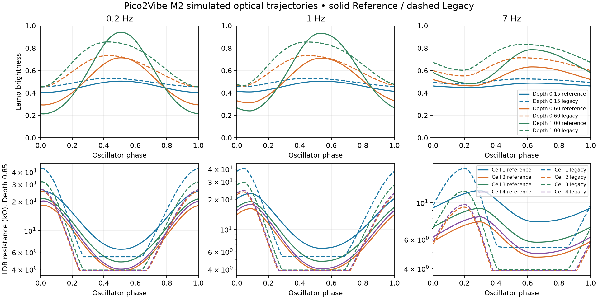

# Pico2Vibe M2: optical Reference model

Implemented from main `780399294a52554771196f2196179c4d187f39cd`, verified equal
to remote main before edits. Work is on `codex/m2-optical-reference`. Reference
is the default shared DSP path for desktop, plugin, WASM and firmware. Selection
of LegacyOptical is internal/offline, without a new plugin parameter or UI.

## Architecture and boundaries

The pre-refactor architecture/classification is preserved in
[m2-optical-architecture-before.md](m2-optical-architecture-before.md). In brief:
phase plus creative Drift → voicing shape (including the 42/58 BulbAsym curve)
→ LFO low-pass → SweepMin + Depth × oscillator × span → sample-based directional
memory → tanh compression → timed asymmetric lamp state → state^1.5 → exponential
resistance LUT → 1.5 ms resistance slew → individual measured mean scales → stages.
`process_legacy_optical()` retains that arithmetic and its original lamp/memory
states. It is an internal LegacyOptical path, distinct from the older desktop
`--engine legacy` transistor/network diagnostic.

Reference: EffectLFO phase → sine excitation LUT → intensity-dependent electrical
operating point → electrical power → asymmetric thermal state → brightness LUT
→ per-cell optical memory → per-cell conductance LUT → bounded resistance[4]
→ unchanged grey-box stages. Each stereo lane owns one OpticalModel; a second
lamp lane and stereo offset remain Studio features, whereas hardware has one lamp.
No tone, transistor, feedback saturation, output-conditioning, oversampling,
Quality algorithm, public parameter ID/range, project schema or UI layout was
redesigned. The existing feedback/noise lamp-hot connection still reads a thermal
state, rather than being silently changed to brightness.

## Equations and approximations

All normalized domains are clamped at their boundaries. Let phase be φ,
Depth be d, and SweepMin/Max be s0/s1:

```text
e(φ) = (1 - cos(2πφ))/2
u = clamp(bias + intensityBias*d + d*lampDrive*(e - 1/2), 0, 1)
q = s0 + (s1 - s0)*u                     electrical lamp drive
P = q*q                                 normalized electrical power
α(τ) = -expm1(-1/(sampleRate*τ))
T[n] = T[n-1] + α(τheat or τcool)*(P - T[n-1])
B = T^lampGamma                         incandescent brightness proxy
Xc[n] = Xc[n-1] + α(τldrUp or τldrDown)*(B - Xc[n-1])
Gc = (1/Rdark + (1/Rlight - 1/Rdark)*Xc^(ldrCurve*sensitivity[c]))/scale[c]
Rc = clamp(1/Gc, Rlight, Rdark)
```

Heating is selected when power exceeds the thermal state; cooling otherwise.
LDR illumination memory selects its rising/falling coefficient similarly. This
is a stable convex update with positive, time-based coefficients, including at
192 kHz. There is no arbitrary coefficient floor. expm1 avoids cancellation.
No audio input drives these states. No allocation occurs in the sample loop.

The sine is a static 257-value LUT with linear interpolation. Brightness and
four conductance curves have 65 samples each, constructed with pow during
prepare/calibration/voicing changes. Linear interpolation is in **conductance**,
followed by reciprocal, not in resistance. LUTs are continuous and monotonic;
slopes have small interpolation corners rather than analytic differentiability.
Boundary clamps can produce flat extrema. These approximations require future
measurement fitting rather than assuming an exact CdS law.

Reference phase uses a wrapping uint32 accumulator: round(frequency × drift ×
2^32/sampleRate) ticks per sample. Its top 24 bits form the normalized phase.
This fixes low-speed floating-point phase accumulation error at high sample
rates without using software doubles on RP2350. Phase set/reset and transport
locking update this accumulator too; Legacy retains its float accumulator.

## Control semantics and calibration

Depth changes both excursion and bias *before* power and brightness conversion.
At zero Depth the lamp settles at the region's bias, rather than following a
scaled final resistance curve. At full Depth the default drive spans u=0.04..1.
SweepMin/Max define an electrical/optical operating region before lamp dynamics.
They are not clipping limits applied after calculating a resistance oscillator.
LampLag scales thermal heating and cooling time constants, retaining 0.35..2.5.
It does not add another smoothing filter. Rate remains the requested oscillator
frequency (including existing tempo sync). Faster excitation gives the lamp less
time to reach extrema and changes mean, asymmetry, resistance and phase lag.
No explicit speed-dependent depth multiplier or 2-D trajectory LUT is used.

| Calibration | Value / mapping | Rationale |
| --- | --- | --- |
| lampAttack, lampRelease | defaults 24 / 70 ms | Different heating/cooling response; engineering starting values |
| integrated voicing mapping | old tuning attack ×2.4, release ×1.75 | Preserve relative voicing character while removing heuristic stacked memory |
| ClassicChorus actual, Lag=1 | 28.8 / 86.8 ms after profile tuning | Used in trajectory grid below |
| lampGamma | 1.5 | Nonlinear incandescent emission proxy |
| lampBias, intensityBias, lampDrive | 0.46, 0.06, 0.96 | Warm operating point, intensity bias shift and drive excursion |
| ldrAttack / ldrRelease | 3 / 12 ms | Slower dark recovery; explicit optical memory |
| ldrCurve | 1.2 × clamp(old curve /7.6009, 0.5, 2) | Conductance power law; engineering assumption |
| cell sensitivity | 0.92, 1.04, 1.00, 1.08 | Small fixed range/curve differences, not measured fits |
| mean scale | 405/290, 233/290, 1, 240/290 | Retain prior Table 1 relative calibration |
| Modern scale blend | 45% measured scale | Existing Studio voicing choice retained |
| component tolerance | existing seeded stage term; standalone ±1.2% | Fixed, subtle, bounded; not creative Drift |
| resistance endpoints | existing tuning, normally 3.9 kΩ..1 MΩ | Safe production range; not paper's full measured dark range |

Integrated calibration uses each existing stage's deterministic scale and sets
OpticalCalibration.tolerance to zero to avoid applying tolerance twice. The four
cells share the lamp but have different means, sensitivities, ranges and thus
trajectories. Drift does not set calibration. It remains the optional seeded
random/sinusoidal Studio frequency variation. Reference operates nonlinearly
with Drift=0. Sample-clock smoothing of optical controls and absolute-sample
32-frame thermal coefficient updates make Reference trajectories independent of
callback partition, including Depth/Rate/Lag/Sweep automation. Existing audio
parameter ramps outside optics retain their previous behavior. Internal
BulbAsym/triangle shapes and hysteresis/LFO low-pass remain Legacy choices;
Reference generates asymmetry through dynamics from sine electrical excitation.

## Academic mapping and limits

The [DAFx-19 paper](https://www.dafx.de/paper-archive/2019/DAFx2019_paper_31.pdf)
measures four cells at 14 frequencies and 11 intensities, also recording the lamp
excitation rate. Section 4 averages extracted periods and downsamples them to
64 points. The implementation uses interpolated measured trajectories; it does
not give identifiable thermal constants or a machine-readable trajectory dataset.
Its observations motivate distinct cells, asymmetric temporal response and
Speed × Intensity dependence here. Table 1 motivates retained relative mean
scales, not an assertion that this model reproduces its resistance extrema.
The paper also describes electrical oscillator frequency/intensity coupling.
M2 models interaction through lamp dynamics while retaining requested Hz/tempo
semantics; it does not emulate intensity-induced oscillator detuning. Thermal
power/emission, conductance laws, times and sensitivity values are explicit
engineering approximations. This is a calibratable reference foundation, not a
measured reproduction of the authors' hardware or their wavetable model.

## Stable optical trajectories

Grid: ClassicChorus defaults, Sweep=0.58..0.98, LampLag=1, width=0, Drift=0,
seed=1, 44.1 kHz, High. Six speeds × five depths × two models = 60 points.
Discard at least five cycles and three seconds, then record four complete cycles.
CSV observes every 32 samples (1378.125 observations/s); the model runs every
sample. Export includes phase, pre-power electrical drive, brightness and all
four resistances. `_averaged.csv` contains 256 phase-bin averages with counts.
Summary includes arithmetic/geometric means, extrema, resistance ratio,
fundamental optical lag, rise fraction, 10–90% trajectory intervals and cycle
mean stability. Positive lag is relative to the fundamental of electrical drive;
resistance is sign-inverted for this metric. Trajectory crossing times are not
step-response time constants. Rise fraction is min→max duration / period;
resistance rise represents darkening. Stability is maximum cycle-mean deviation
from the four-cycle mean, not a claim about random jitter.

| Hz | Depth | B min | B max | B mean | Cell1 Rmin kΩ | Rmax kΩ | Geomean kΩ | Rmax/Rmin | Lamp lag cycles |
| --- | --- | --- | --- | --- | --- | --- | --- | --- | --- |
| 0.2 | 0.15 | 0.4036 | 0.5051 | 0.4544 | 11.38 | 14.55 | 12.81 | 1.28 | 0.011 |
| 0.2 | 0.60 | 0.2926 | 0.7134 | 0.4920 | 7.79 | 20.65 | 12.32 | 2.65 | 0.012 |
| 0.2 | 1.00 | 0.2130 | 0.9408 | 0.5412 | 5.75 | 29.14 | 12.09 | 5.07 | 0.012 |
| 1 | 0.15 | 0.4091 | 0.5043 | 0.4587 | 11.40 | 14.32 | 12.66 | 1.26 | 0.054 |
| 1 | 0.60 | 0.3116 | 0.7092 | 0.5091 | 7.85 | 19.25 | 11.69 | 2.45 | 0.054 |
| 1 | 1.00 | 0.2399 | 0.9325 | 0.5700 | 5.81 | 25.54 | 11.03 | 4.40 | 0.054 |
| 7 | 0.15 | 0.4487 | 0.4880 | 0.4687 | 11.82 | 12.89 | 12.29 | 1.09 | 0.180 |
| 7 | 0.60 | 0.4630 | 0.6324 | 0.5479 | 8.91 | 12.27 | 10.26 | 1.38 | 0.184 |
| 7 | 1.00 | 0.4838 | 0.7859 | 0.6331 | 7.03 | 11.55 | 8.73 | 1.64 | 0.184 |

All four Reference cells at 1 Hz / Depth=0.85:

| Cell | Rmin kΩ | Rmax kΩ | Mean kΩ | Geomean kΩ | Ratio | Optical lag cycles |
| --- | --- | --- | --- | --- | --- | --- |
| 1 | 6.48 | 22.92 | 12.42 | 11.26 | 3.54 | 0.065 |
| 2 | 3.90 | 16.13 | 8.20 | 7.23 | 4.14 | 0.065 |
| 3 | 4.81 | 18.95 | 9.83 | 8.76 | 3.94 | 0.065 |
| 4 | 4.05 | 17.80 | 8.85 | 7.74 | 4.39 | 0.065 |

Legacy vs Reference, Depth=0.85:

| Model | Hz | Brightness excursion | B mean | Cell1 geomean kΩ | Ratio | Lamp rise 10–90 s | Fall 90–10 s |
| --- | --- | --- | --- | --- | --- | --- | --- |
| legacy | 0.2 | 0.3615 | 0.6515 | 11.49 | 8.09 | 1.235 | 1.709 |
| reference | 0.2 | 0.6097 | 0.5210 | 12.15 | 3.97 | 1.434 | 1.445 |
| legacy | 1 | 0.3518 | 0.6620 | 10.75 | 7.54 | 0.240 | 0.345 |
| reference | 1 | 0.5787 | 0.5453 | 11.26 | 3.54 | 0.271 | 0.311 |
| legacy | 7 | 0.2086 | 0.7025 | 7.68 | 2.99 | 0.031 | 0.051 |
| reference | 7 | 0.2503 | 0.5994 | 9.28 | 1.54 | 0.032 | 0.052 |



Full grid summary: [optical-summary.csv](regression/m2/optical-summary.csv).
Worst Reference cycle-mean relative spread is 0.047%, below the 1%
behavioral regression limit. Full raw/averaged CSVs are in `build/m2/optics`.

## Legacy vs Reference audio

Captured the unmodified baseline before core edits. The final instrumented
Legacy reproduces **all 5,175 metric values and 96 output WAVs exactly** (identical
SHA256). Original factory levels are retained offline for this regression.
`--optical reference --factory-levels baseline` compares optics while retaining
identical musical/audio parameters, seed, Quality and output conditioner.
Eight signals per preset: impulse, log sweep, synthetic guitar, five sine levels.
The following values use that optical-only comparison; L/R means Legacy/Reference.
THD is the existing worst-level dynamic harmonic metric, not a static transistor
measurement. Frequency response/notch tracking are existing approximate sweep
analyses; changed notch events are retained separately rather than falsely pairing
rows when event counts differ. Side/mid refers to the synthetic guitar.

| Preset | Guitar RMS L/R | ΔdB | Peak L/R | Deepest notch dB L/R | Worst THD dB L/R | Side/mid dB L/R |
| --- | --- | --- | --- | --- | --- | --- |
| Classic Uni-Vibe | 0.05879 / 0.05726 | -0.23 | 0.704 / 0.700 | -9.23 / -9.52 | -21.85 / -21.39 | -21.64 / -28.94 |
| Shin-ei Dark | 0.06093 / 0.05917 | -0.25 | 0.696 / 0.694 | -10.45 / -10.94 | -22.85 / -21.58 | -20.33 / -26.75 |
| Deja Lead | 0.05736 / 0.05522 | -0.33 | 0.683 / 0.683 | -9.14 / -9.47 | -21.90 / -20.08 | -22.98 / -29.39 |
| Voodoo Wide | 0.05889 / 0.05374 | -0.79 | 0.721 / 0.713 | -9.66 / -9.71 | -22.32 / -21.98 | -6.59 / -11.07 |
| Modern Hi-Fi | 0.05496 / 0.05370 | -0.20 | 0.645 / 0.629 | -7.94 / -7.96 | -22.73 / -22.67 | -18.17 / -24.22 |
| Classic Vibrato | 0.05800 / 0.05904 | +0.15 | 0.572 / 0.561 | -11.12 / -11.12 | -15.57 / -15.70 | -25.21 / -34.37 |
| Hendrix Deep | 0.05966 / 0.05953 | -0.02 | 0.641 / 0.651 | -13.56 / -13.47 | -21.63 / -21.12 | -13.03 / -17.44 |
| Gentle Clean | 0.05475 / 0.05384 | -0.15 | 0.594 / 0.586 | -7.15 / -7.17 | -24.87 / -24.75 | -37.95 / -45.43 |
| Rotary Fast | 0.05534 / 0.05449 | -0.14 | 0.620 / 0.602 | -7.45 / -7.49 | -23.13 / -22.76 | -26.12 / -33.64 |
| Bass Anchor | 0.05463 / 0.05361 | -0.16 | 0.600 / 0.593 | -7.17 / -7.18 | -24.89 / -24.86 | -43.11 / -50.98 |
| Lamp Drift | 0.06156 / 0.05816 | -0.49 | 0.678 / 0.675 | -9.40 / -9.32 | -23.87 / -22.19 | -21.48 / -29.49 |
| Psychedelic Slow | 0.07837 / 0.07293 | -0.62 | 0.652 / 0.659 | -12.89 / -12.90 | -23.11 / -26.29 | -10.47 / -15.49 |

[Optical-only comparison CSVs](regression/m2/optical-ab/metric_comparison.csv)
include notch tracks, frequency response, THD, stereo correlation/fold metrics,
WAV RMS/peak/deltas and hashes. [Final factory comparison](regression/m2/factory-ab/metric_comparison.csv)
includes the preset level changes below. Input/output WAVs remain in
`build/m2/legacy`, `build/m2/reference`, `build/m2/reference_factory`.
The WAV writer bounds exported samples to ±1; DSP summary/JUCE level checks
supplement exported metrics. The old sound is a comparison baseline, not a
calibration target. No output algorithm was changed to reproduce it.

## Factory presets

All 12 presets were objectively analyzed and passed the unchanged JUCE finite,
peak, mono retention and <15% preset RMS-spread tests. Five outputGain changes
were necessary to retain that bank-level usability criterion after altered
phase cancellation. All other factory values are unchanged. These are static
factory level trims, not calibration fixes or a new compensation algorithm.
The same trims were applied only after optical bounds/inertia tests passed;
untrimmed comparisons above remain available. A human listening audition and
hardware comparison remain outstanding; metrics do not establish preference.

| Preset | Old Output Gain | New | Reason |
| --- | --- | --- | --- |
| Shin-ei Dark | 1.07 | 1.15 | Changed optical region reduced test passage RMS |
| Deja Lead | 1.03 | 1.09 | Bring bank level within existing spread criterion |
| Hendrix Deep | 1.00 | 1.34 | Deep chorus cancellation caused largest level reduction |
| Lamp Drift | 1.01 | 1.07 | Bring bank level within existing spread criterion |
| Psychedelic Slow | 1.04 | 1.20 | Slow deep trajectory increased level variation/cancellation |

Preset recall smoke expectation for Deja outputGain was updated to 1.09.
The loudness threshold was not weakened. Saved projects retain their stored
output_gain value; recalling a factory preset installs its new trim.

## CPU and memory

Windows x64 Release, MinGW GCC 14.2, AMD Ryzen 7 7730U. Three sequential runs;
each mean averages 10,000 full-core blocks, or 20,000 optical-step blocks, of 32
stereo frames at 44.1 kHz. The table reports the median of three run means and
the largest observed block wall time across them. The isolated optical step
uses fixed precomputed excitation and both lanes; full core includes LFO,
calibration control cadence and identical audio DSP. Diagnostic trajectory
writes are present in both compiled paths. Warmup precedes full-core timing.

| Path | Legacy ns/stereo frame | Reference ns/stereo frame | Change | Max block μs L/R |
| --- | --- | --- | --- | --- |
| Optical step (two lanes) | 58.36 | 84.06 | +44.1% | 256.9 / 161.3 |
| Full core Eco | 386.98 | 422.37 | +9.1% | 666.9 / 674.2 |
| Full core Standard | 412.33 | 426.20 | +3.4% | 298.8 / 647.9 |
| Full core High | 625.22 | 679.32 | +8.7% | 256.7 / 661.8 |

[cpu-run-1.csv](regression/m2/cpu-run-1.csv), runs 2/3 beside it, preserve all
measurements, including scheduler spikes. Maxima include Windows preemption;
they are not WCET/deadline guarantees on RP2350. Fixed-parameter desktop
benchmarks also do not measure voicing-change LUT reconstruction cost.
No per-sample pow/exp/log/trig is added to Reference optics; pow is confined to
calibration, exponentials to coefficient/control updates. OpticalModel is 1,472
bytes; Vibe is 5,464 bytes on this compiler (two fixed-size model instances).
RP2350 firmware builds, but on-device CPU/deadline and memory measurements
remain necessary before claiming a real-time hardware budget.

## Validation

- Desktop Release build and CTest: **8/8 pass**. Existing silence/frozen/feedback,
  phase-notch, stage, block-invariance and output-conditioning checks pass.
- Optical unit tests: monotonic light→resistance, finite bounds, asymmetric step
  response, speed inertia, intensity excursion, deterministic seed, subtle fixed
  tolerance, four-cell distinction, static and automated callback partitions
  1/5/7/16/31 vs 32. Equivalent lamp extrema/means and resistance tested through
  the actual oscillator at 44.1/48/96/192 kHz (not an ideal external phase source).
- Trajectory regression: **60/60 operating points pass**; four cells and lamp,
  phase lag, cycle stability, intensity response and speed inertia.
- Full parameter manifest before/after: identical IDs, labels, units, flags,
  defaults and normalized physical ranges. Project schema stays version 1.
- JUCE 7.0.12 VST3 Release and smoke: **1/1 pass**, including all presets/Qualities,
  44.1/48/96/192 kHz, mono/stereo, arbitrary/empty blocks, state/transport/editor.
- pluginval 1.0.4 strictness 8, seed 0x7f78bbf, no GUI tests: **SUCCESS, exit 0**.
- WASM: production C++17 em++ -O3 build with complete existing exports passes.
- RP2350/pico2: **ELF and UF2 build pass**, SDK 2.2.0, GCC Arm 10.3.1. The old
  SDK cache lacked import files; a shallow SDK and TinyUSB were fetched only
  under ignored `build/m2`. No device was flashed. Upstream host-tool warnings
  occurred on the first build; shared DSP compilation succeeded.
- No hosted CI run, MSVC confirmation or subjective listening test was performed.

Logs and evidence are in [regression/m2](regression/m2).

## Reproduction

```powershell
cmake -S desktop_tools -B build/desktop_tools -G Ninja -DCMAKE_BUILD_TYPE=Release
cmake --build build/desktop_tools --parallel 4
ctest --test-dir build/desktop_tools --output-on-failure
build/desktop_tools/optical_analyze.exe --out-dir build/m2/optics
python desktop_tools/scripts/validate_optical.py build/m2/optics/summary.csv
# Construct the same full bank for each rendering.
$factoryArgs = 0..11 | ForEach-Object { '--preset'; "factory_$_" }
build/desktop_tools/dsp_validate.exe --out-dir build/m2/legacy --quality high --optical legacy @factoryArgs
build/desktop_tools/dsp_validate.exe --out-dir build/m2/reference --quality high --optical reference --factory-levels baseline @factoryArgs
build/desktop_tools/dsp_validate.exe --out-dir build/m2/reference_factory --quality high --optical reference @factoryArgs
python desktop_tools/scripts/compare_optical.py build/m2/legacy build/m2/reference docs/regression/m2/optical-ab
# Optional, with matplotlib installed:
python desktop_tools/scripts/plot_optical.py build/m2/optics docs/regression/m2/trajectories.png
```

The existing M0/M1 exact comparison script is unchanged; compare the fresh Legacy
run with `build/m2/before` using `compare_regression.py`. For a new baseline,
checkout main 7803992 in a separate directory and run the old harness first.
JUCE/pluginval/WASM commands remain those documented in M0/M1/workflows. Firmware
uses PICO_SDK_PATH pointing to a complete SDK and the normal root CMake target.
No build dependencies or outputs were committed to the source tree.

## Remaining uncertainties and next step

Collect voltage/current/lamp brightness and all four LDR resistances on a real
unit across Speed × Intensity, including several stable cycles and controlled
warmup. Fit bias, drive, thermal/emission and cell conductance/time constants
jointly; characterize dark-range ceiling, intensity detuning and photoconductor
memory. Add measurement-error/trajectory-shape regression targets. Audition the
rendered factory bank with guitar/bass and blinded level-matched A/B, then measure
RP2350 block timing on-device (including control/preset changes). These are the
next optical-validation steps. Transistor/nonlinearity fidelity remains a separate
milestone and was not started.

## Files changed

- `src/dsp/optical_model.hpp`: compact calibrated lamp/photocell component.
- `src/dsp/vibe_core.hpp`: optical mode/phase integration, exact Legacy path,
  four-cell resistances feeding existing networks, diagnostic snapshots.
- `src/dsp/factory_presets.hpp`: five documented outputGain trims.
- `desktop_tools/src/processor.hpp`, `.cpp`, `analysis_main.cpp`: internal optical
  selection and frozen factory levels for controlled A/B.
- `desktop_tools/src/optical_analysis.cpp`, `optical_model_test.cpp`,
  `desktop_tools/CMakeLists.txt`: grid metrics, benchmarks and unit tests.
- `desktop_tools/scripts/compare_optical.py`, `validate_optical.py`,
  `plot_optical.py`, `desktop_tools/README.md`: reproduction/inspection tools.
- `plugin/juce/PluginSmokeTest.cpp`: changed preset recall value, same thresholds.
- Architecture note, this report and `docs/regression/m2/*`: retained evidence.
