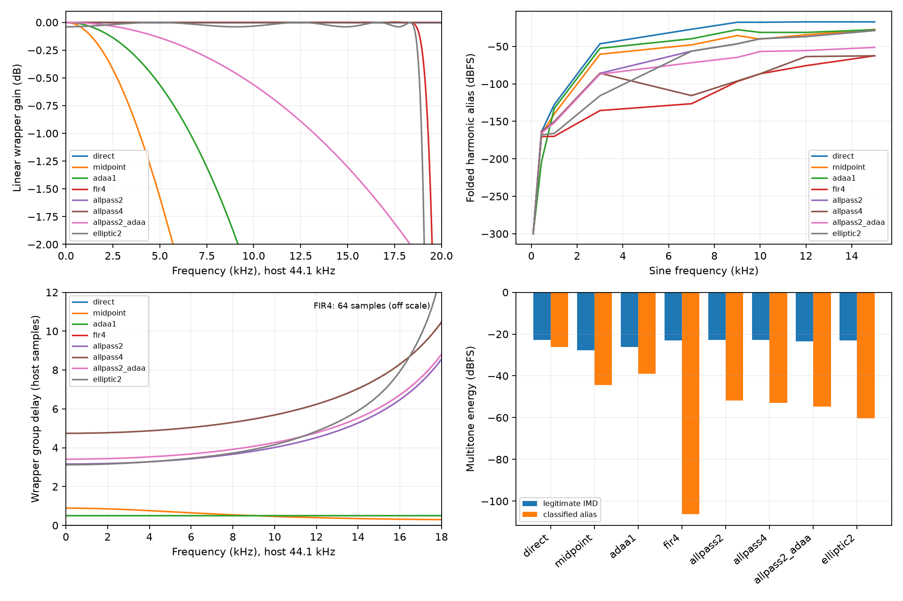

# M3.1 low-latency antialiasing

## Decision

Keep shipping Eco/Standard direct and High midpoint. The new polyphase allpass
2x is the best low-cost **isolated** candidate and C (OS2 / Direct / OS2) is the
preferred next experiment. It does not meet the complete shipping gate: its
phase rotates the wet path relative to dry, creates additional cancellation
notches, and the complete conditioned effect does not consistently beat the
existing midpoint for attributed alias. 4x has a substantial isolated sine
advantage but more phase rotation and cost; its upper-band multitone alias
advantage over allpass 2x is only 1.15 dB in the 44.1 kHz case.

No transfer, optical model, phase cell, parameter, preset, UI, host latency
reporting or production Quality mapping changed. Candidates are connected to
the actual Vibe core behind `VIBE_DESKTOP_ANALYSIS`; the standalone filter
header can be evaluated for a future MCU implementation without allocating
FIR buffers in production. No hardware listening/calibration claim is made.

## Frozen M3 and reproducibility

Base and freshly fetched origin/main: `ab9c41ad3aafa18566614a35945afd85c6436a4a`.
Before runtime edits, twelve Standard and twelve High factory runs were
captured with the existing analyzer binary. Their metrics are retained in
`regression/m3-1/baseline`; 192 output WAVs are in ignored
`build/m3-1/before/{standard,high}`. Fresh after runs have **zero differences**:
5,181 Standard and 5,217 High metric values, plus 96 byte-identical WAVs each.
The complete metrics include frequency response, harmonic/THD, notch tracking,
RMS/peak and stereo/mono behavior. M3 static characterization remains in
`regression/m3`; Direct and Midpoint are measured again in the expanded matrix.

All 122 non-timing optical CSVs are byte-identical to M3. Frozen linear notches
retain SHA256 `97513543fed7d6e9855570d23e756c9191123022df4db03af3e1ec4d2b26b6b6`.
The public parameter manifest is unchanged. Regression comparison CSVs and
`optical-hashes.csv` retain the evidence. Baseline factory audio is unchanged
in both Qualities; no intentional new High baseline is installed.

```
cmake --build build/desktop_tools
ctest --test-dir build/desktop_tools --output-on-failure
build/desktop_tools/nonlinear_analyze docs/regression/m3-1
build/desktop_tools/nonlinear_test docs/regression/m3-1/numerical.csv
build/desktop_tools/linear_wrapper_response docs/regression/m3-1
build/desktop_tools/low_latency_analyze docs/regression/m3-1
build/desktop_tools/aa_notch_trajectory docs/regression/m3-1/aa-notches.csv
python desktop_tools/scripts/validate_low_latency.py docs/regression/m3-1
python desktop_tools/scripts/plot_low_latency.py docs/regression/m3-1
```

## Transfer and locations

The existing `vibe_bjt_transfer` and `soft_clip_cubic` files are unchanged:

```
f(z) = z(27+z²)/(27+9z²)
y(x) = GainTrim * SatOutTrim * [f((.84*x+Asymmetry)*Drive)-f(Asymmetry*Drive)]
```

Input BJT shaping precedes the four grey-box cells. Output BJT shaping follows
the phase network. The rational feedback curve is inside the bounded feedback
loop; its tap precedes output shaping. Final DC blocker/headroom/rational
limiter remains outside the circuit path and is unchanged. Full-effect captures
and CPU include that conditioner. It can generate its own aliases; isolated
input/output wrapper results alone cannot predict full-effect alias rejection.

## Allpass topology and coefficients

Use Laurent de Soras' [HIIR coefficient designer](https://raw.githubusercontent.com/unevens/hiir/4589fedb4d08b899514cb605ccd7418bf262ab18/PolyphaseIir2Designer.h)
at pinned revision `4589fedb4d08b899514cb605ccd7418bf262ab18`.
`compute_coefs(c, 80, .08)` returns six coefficients; the corresponding analytic
stopband attenuation from the designer is 94.8529 dB. Transition width .08 is
normalized to the 2x clock: passband edge .21 and stopband edge .29 cycles per
2x sample (18.522/25.578 kHz at host 44.1 kHz). This is filter rejection, not
nonlinear alias rejection. Regenerate with `scripts/design_allpass.ps1`.

```
a = [0.045362164348961023, 0.16808748123450207,
     0.33714968797907374,  0.52237785430835371,
     0.70806413636353838,  0.89744559117277378]
```

Float coefficients are used in the core. At base rate, each section is
`A_a(z)=(a+z^-1)/(1+a*z^-1)`, with transposed one-state recurrence
`y=a*x+s; s=x-a*y`. Even and odd coefficient indices form E and O, each
three sections. Interpolation emits E(x), O(x) in that chronological order;
the unchanged nonlinear function is evaluated twice. Decimation processes the
even nonlinear sample through E and odd through O, returning half the sum of
the current E result and the previous O result. It therefore includes the
necessary odd-branch delay, rather than just averaging nonlinear evaluations.
The equivalent high-rate half-band low-pass is
`H(z)=.5*[E(z²)+z^-1*O(z²)]`. In the linear roundtrip, the host-rate response is
`.5*[E(z)²+z^-1*O(z)²]`. All base-rate poles are `-a`, strictly inside unity;
section states below 1e-20 are zeroed to prevent denormal tails.

4x cascades two such stages, each with independent interpolation/decimation
histories; the inner stage runs twice per host sample. OS2+ADAA applies first
order antiderivative processing to the chronologically interleaved 2x samples.
Its primitive and small-difference safeguard are inherited from M3. No post-EQ
or gain compensation is applied to any candidate.

## Conventional elliptic comparison

The desktop-only conventional IIR uses four biquads in transposed direct form
II per interpolation and decimation filter (eighth order each). It zero-inserts,
scales by two, evaluates the curve at each substep, low-passes and keeps the
even decimation phase. Reproduce with SciPy 1.17.0:
`ellipord(.42,.58,.02,80)`, then `ellip(N,.02,80,Wn,output='sos')`.
[Official SciPy design documentation](https://docs.scipy.org/doc/scipy/reference/generated/scipy.signal.ellip.html)
explains normalized frequencies and SOS representation. Full exact coefficients
are in `desktop_tools/src/elliptic_candidate.hpp`; generation is in
`scripts/design_low_latency_iir.py`. The largest pole radius is about .9464.
It is slightly faster in DC group delay but costs more arithmetic/state than
the allpass and has a 0.04 dB roundtrip DC loss. That loss is reported rather
than compensated; its DC regression uses an explicit 1% tolerance, while
allpass/direct/FIR/ADAA settled DC checks retain 2e-6 absolute tolerance.

## Measurements and attribution

Reuse the M3 calibrated 32,768-point FFT and proper folded-harmonic masks,
periodic Hann, five-bin neighborhoods, orders 1–128 for sine and signed
multitone combinations through total order seven. Warmup is 8,192 samples for
isolated nonlinearities. The matrix covers BJT drives .8/1.5/3.2, nine input
levels -60 to 0 dBFS, nine frequencies including every requested tonal probe,
four sample rates and all candidates. All output nonfinite values fail the run.
Above-Nyquist H2–H5 are NaN; colliding legitimate/alias bins are excluded from
alias attribution, making those values lower bounds. Floor values such as
-300 dB are numerical reporting floors, not physical suppression claims.

`null.csv` adds a **phase-only** low-frequency null beside the inherited gain-
aligned diagnostic. At 79.4 Hz, allpass 2x and 4x null around -136 dBc without
gain compensation. The 16x analytic-input multitone comparator compares
magnitudes; phase-shaped input can change legitimate product interference.
It is not circuit ground truth and does not isolate aliases by subtraction.

### Static 44.1 kHz, drive 3.2, asymmetry .08, 0 dBFS

| Wrapper | 7k alias dBFS | 7k improvement dB | 7k H1 delta dB | 15k alias dBFS | 15k improvement dB | 15k H1 delta dB |
|---|---|---|---|---|---|---|
| direct | -27.076 | 0.000 | 0.000 | -17.222 | 0.000 | 0.000 |
| midpoint | -47.886 | 20.810 | -2.389 | -27.321 | 10.099 | -8.240 |
| adaa1 | -39.740 | 12.664 | -0.509 | -27.712 | 10.490 | -3.673 |
| fir2 | -56.232 | 29.156 | -0.000 | -28.739 | 11.516 | 0.000 |
| fir4 | -126.442 | 99.366 | -0.000 | -62.482 | 45.259 | 0.000 |
| allpass2 | -56.231 | 29.155 | 0.000 | -28.739 | 11.517 | -0.000 |
| allpass4 | -115.594 | 88.518 | -0.000 | -62.482 | 45.259 | -0.000 |
| allpass2_adaa | -71.689 | 44.613 | -0.118 | -51.313 | 34.090 | -0.593 |
| elliptic2 | -56.280 | 29.204 | -0.011 | -28.788 | 11.566 | -0.023 |

OS2 passes the mandatory 7 kHz 15 dB target, with 29.15 dB improvement. Its
15 kHz improvement is meaningful at 11.52 dB but misses the preferred 15 dB.
4x passes both comfortably. The hybrid improves rejection but retains ADAA
averaging loss: about .59 dB at 15 kHz at this level, and more at low level.
FIR4 is the offline quality ceiling, with 64 host samples of linear-phase delay;
it is never connected to the live feedback loop.

### Magnitude, phase, group delay and latency

`linear_wrapper_response` excites a small 1e-5 impulse after silent priming;
it measures complex response, unwraps phase, and takes a centered complex
phase derivative for group delay. `all-wrapper-response.csv` contains DC,
80/440/1k/3k/5k/7k/10k/15k for every wrapper and rate; `response-spectrum.csv`
contains the dense response. Phase delay and group delay are distinct.

| Wrapper | DC samples | 80 Hz | 1 kHz | 10 kHz | 15 kHz |
|---|---|---|---|---|---|
| direct | -0.000 | -0.000 | -0.000 | -0.000 | -0.000 |
| midpoint | 0.889 | 0.889 | 0.879 | 0.462 | 0.334 |
| adaa1 | 0.500 | 0.500 | 0.500 | 0.500 | 0.500 |
| fir2 | 64.000 | 64.000 | 64.000 | 64.000 | 64.000 |
| fir4 | 64.000 | 64.000 | 64.000 | 64.000 | 64.000 |
| allpass2 | 3.160 | 3.160 | 3.167 | 4.013 | 5.796 |
| allpass4 | 4.740 | 4.740 | 4.748 | 5.685 | 7.595 |
| allpass2_adaa | 3.410 | 3.410 | 3.417 | 4.263 | 6.046 |
| elliptic2 | 3.121 | 3.121 | 3.131 | 4.154 | 6.712 |

Allpass 2x/4x linear roundtrip magnitude deviations through 15 kHz at 44.1/48
are below 0.00001 dB in this float measurement. They satisfy .1/.25/.5 dB
passband targets without compensation. At 44.1 kHz one 2x wrapper has about
71.7 us low-frequency group delay; input plus output contributes about 143 us.
The impulse maximum is 4 samples for 2x; that is not constant
linear-phase latency. At 10 kHz its group delay is 4.013 samples per wrapper.

Shipping reports zero host latency because its original causal midpoint path
is retained; no new fixed scheduling delay or FIR is introduced. Experimental
allpass phase delay is internal and frequency dependent. Host PDC would not
repair its frequency-dependent wet/dry rotation; no latency reporting change
is shipped. If promoted later, dry/wet alignment and host policy need a new
measured decision rather than assuming integer PDC solves this problem.



### Multitone 44.1 kHz

| Wrapper | Legitimate IMD dBFS | Classified alias dBFS | Unclassified dBFS | Reference magnitude residual dBFS |
|---|---|---|---|---|
| direct | -22.752 | -26.242 | -58.829 | -26.241 |
| midpoint | -27.740 | -44.490 | -68.230 | -15.071 |
| adaa1 | -26.211 | -38.989 | -71.601 | -20.335 |
| fir2 | -22.995 | -60.289 | -61.715 | -39.969 |
| fir4 | -22.995 | -106.281 | -64.895 | -40.025 |
| allpass2 | -22.756 | -51.694 | -61.518 | -51.095 |
| allpass4 | -22.756 | -52.844 | -64.546 | -52.334 |
| allpass2_adaa | -23.551 | -54.703 | -66.614 | -32.546 |
| elliptic2 | -23.130 | -60.411 | -61.799 | -36.004 |

OS2 preserves total legitimate IMD within .005 dB of Direct while reducing
classified alias by 25.45 dB. Midpoint suppresses legitimate IMD by 4.99 dB.
4x allpass reduces this multitone classified alias only another 1.15 dB;
legitimate product changes and unclassified energy are separately retained.
Individual harmonic/product gain differences are in the sine tables and
`harmonic-deltas.csv`; no broadband residual is labeled pure alias.

### Quality harmonic consistency

`harmonic-deltas.csv` reports fundamental, H2/H3/H4/H5 and in-band THD delta
against Direct for every level, drive, frequency and rate. The following
0 dBFS drive-3.2 cases illustrate candidate versus Standard's same transfer;
these are isolated wrappers, not complete preset outputs. Values near the
floating-point floor at very low input levels are not reliable harmonic ratios.

| Wrapper | Hz | H1 delta | H2 delta | H3 delta | H4 delta | H5 delta | THD delta |
|---|---|---|---|---|---|---|---|
| midpoint | 80 | -0.000 | -0.001 | -0.003 | -0.006 | -0.009 | -0.003 |
| allpass2 | 80 | -0.000 | -0.000 | 0.000 | 0.000 | 0.000 | 0.000 |
| midpoint | 440 | -0.012 | -0.044 | -0.103 | -0.180 | -0.281 | -0.102 |
| allpass2 | 440 | -0.000 | 0.000 | 0.000 | -0.000 | 0.000 | 0.000 |
| midpoint | 1000 | -0.060 | -0.224 | -0.513 | -0.870 | -1.315 | -0.489 |
| allpass2 | 1000 | -0.000 | 0.000 | 0.000 | -0.000 | -0.000 | 0.000 |
| midpoint | 3000 | -0.517 | -1.724 | -3.507 | -5.210 | -7.152 | -2.960 |
| allpass2 | 3000 | 0.000 | -0.000 | 0.000 | -0.000 | -0.000 | -0.000 |
| midpoint | 7000 | -2.389 | -6.018 | -11.530 | — | — | -7.892 |
| allpass2 | 7000 | 0.000 | 0.000 | -0.050 | — | — | -0.044 |
| midpoint | 10000 | -4.243 | -9.305 | — | — | — | -5.062 |
| allpass2 | 10000 | -0.000 | -0.000 | — | — | — | -0.000 |
| midpoint | 15000 | -8.240 | — | — | — | — | 0.000 |
| allpass2 | 15000 | -0.000 | — | — | — | — | 0.000 |

The selected shipping Standard/High harmonic differences remain the M3
Direct/Midpoint differences. OS2 largely preserves low-frequency harmonic
balance, but that is insufficient to preserve the dry/wet phase network.

## Deliberate complete-core matrix

All strategy comparisons use High coefficient update scheduling and wet
smoothing to isolate nonlinear strategy changes. CPU also measures actual
Eco/Standard/current High scheduling independently. The internal selector is
not a parameter or a factory value.

| Candidate | Input | Feedback | Output |
|---|---|---|---|
| A | Direct | Direct | Direct |
| B | MidpointLegacy | MidpointLegacy | MidpointLegacy |
| C | OS2 | Direct | OS2 |
| D | OS2 | MidpointLegacy | OS2 |
| E | OS2 | OS2 | OS2 |
| F | ADAA1 | Direct | ADAA1 |
| G | OS4 | Direct | OS4 |
| H | OS2+ADAA1 | Direct | OS2+ADAA1 |

4 × 5 × 4 × 6 × 8 = 3,840 full-effect FFT-length captures cover rates
44.1/48/96/192, requested feedback 0/.25/.45/.60/.70, modulation
(.18 Hz, depth 1), (1.2 Hz, .6), (7 Hz, 1), plus stationary (1.2 Hz, 0),
and 7 kHz sine, upper-band multitone, deterministic guitar-like transients,
impulse, DC and silence. Public feedback clamps .70 to the supported .65;
CSV feedback is the **requested** value. Stress uses Drive 6, trim 1.2 and
asymmetry +.25; supplementary two-cycle runs also use -.25. Sine/DC input
reach 0 dBFS. Every core call is at most PERIOD=32; callback partitions split
at sample-addressed automation events. No discarded preliminary harness
results are retained.

`full-effect.csv` includes RMS/peak, mono/stereo RMS, broadband HF energy,
Direct difference and late capture RMS. These time-varying metrics are not
alias estimates. `full-stationary-alias.csv` classifies only depth-zero sine/
multitone bins, with collision counts and unclassified residual. Full-effect
residual can contain modulation sidebands, conditioner aliases, envelope
response and phase rotation. Warmup/capture duration is N/Fs; short FFT captures
at high rates are supplemented with two full slow/deep cycles (11.11 seconds
captured after another two warmup cycles), both extreme biases, all candidates
and all rates in `long-stress.csv` (64 runs).

| Candidate | Requested feedback | RMS | Peak | Direct difference RMS | Stationary alias lower bound dBFS |
|---|---|---|---|---|---|
| A_direct | 0 | 0.529 | 0.693 | 0.000 | -32.960 |
| B_midpoint | 0 | 0.419 | 0.571 | 0.141 | -57.404 |
| C_os2_direct | 0 | 0.516 | 0.686 | 0.068 | -43.787 |
| D_os2_midpoint | 0 | 0.516 | 0.686 | 0.068 | -43.787 |
| E_os2_all | 0 | 0.516 | 0.686 | 0.068 | -43.787 |
| G_os4_direct | 0 | 0.325 | 0.496 | 0.289 | -50.440 |
| A_direct | 0.7 | 0.535 | 0.688 | 0.000 | -32.597 |
| B_midpoint | 0.7 | 0.398 | 0.546 | 0.145 | -57.725 |
| C_os2_direct | 0.7 | 0.515 | 0.693 | 0.143 | -50.243 |
| D_os2_midpoint | 0.7 | 0.512 | 0.693 | 0.137 | -46.324 |
| E_os2_all | 0.7 | 0.513 | 0.678 | 0.056 | -42.212 |
| G_os4_direct | 0.7 | 0.245 | 0.382 | 0.354 | -47.886 |

The final conditioner limits how much complete-path AA can be gained from
input/output wrappers alone. C is the best next low-cost architecture because
its feedback is unchanged, not a shipping winner. Comparing C/D/E at high
feedback shows that putting midpoint or OS2 inside the loop changes RMS,
resonance/cancellation and residual. Impulse late RMS is a decay observation,
not a fitted physical resonance/Q. All 3,840 captures and 64 supplemental long captures were finite/bounded. The largest full capture peak was 0.7138; the largest supplemental slow/deep peak was 0.7209. Silence after deterministic zero reset stayed zero. Decay-tail and per-candidate balance data remain in the raw CSVs rather than being collapsed into an unsupported resonance-fit claim.

### Notch trajectories

`unchanged-notches.csv` is the exact M3 linear optical/phase-network probe.
`aa-notches.csv` adds Direct/Midpoint/ADAA/OS2/OS4 input+output linear wrapper
responses to that same settled single-lamp four-cell network, over two cycles
of all twelve factory optical settings. It uses equal dry/wet and normalized
small-signal gains, and excludes feedback, Studio compensation, wet LP and
conditioner. For 4x, the analytic cascade neglects the tiny interpolation-image
contribution; the separate impulse tool measures its actual roundtrip exactly.
This probe diagnoses added cancellations, not exact nonlinear full-effect
notch depth or a resonance fit. Frequency-ordered branches are not persistent
notch identities; changed event counts are preserved.

Classic at phase .00103: Direct has its low notch at 103.946 Hz. OS2 shifts it
to 99.369 Hz and adds minima at 3,613/9,730/14,462/17,790 Hz, roughly -13 dB.
These extra cancellations reject an automatic High replacement even with
Direct feedback. Correcting them with Tone/Mix/OutputGain/preset changes is
outside this milestone and was not attempted.

## CPU and memory

Desktop Release, GCC 14.2, O3, steady_clock; mean/p95/p99/max per stereo host
sample from 32-sample calls, including the unchanged conditioner. Five actual
factory configurations are Classic, Hendrix Deep, Voodoo Wide, Modern Hi-Fi
and Classic Vibrato. `full-cpu.csv` retains each preset, candidate, rate and
percentiles. This table averages each preset mean equally:

| Fs | Eco ns | Standard ns | Current High ns | C OS2 ns | G OS4 ns | H hybrid ns | C vs High |
|---|---|---|---|---|---|---|---|
| 44100 | 387.2 | 420.0 | 641.8 | 669.5 | 784.2 | 1027.7 | +4.3% |
| 48000 | 385.3 | 417.3 | 636.2 | 678.5 | 782.1 | 1013.9 | +6.6% |
| 96000 | 385.6 | 416.0 | 637.5 | 663.6 | 776.9 | 1025.0 | +4.1% |
| 192000 | 383.4 | 416.4 | 637.2 | 664.5 | 776.8 | 1018.2 | +4.3% |

C versus current High ranges from +4.1% to +6.6% across these runs. The largest observed full-path block-normalized maximum is 3715.6 ns/sample. Maxima and percentile variability include desktop scheduler noise and do not establish realtime deadlines. Additional independent state-test CPU captures are deliberately not substituted for this measured run.

Isolated curve/wrapper measurements are in `cpu.csv`; object_bytes includes
all desktop references and is not a production memory budget. The inherited
nominal delay column is NaN for new IIR modes; measured delays are in the
impulse-response CSV, never inferred from CPU timing.

| Storage | Bytes, Windows x64 |
|---|---:|
| Six float allpass coefficients (shared read-only) | 24 |
| Compact single OS2 wrapper histories | 52 |
| Desktop strategy state (two stages plus ADAA history/alignment) | 120 |
| Desktop two-channel input/feedback/output states | 720 |
| Vibe with analysis selector/states | 6912 |
| Production Vibe, before and after | 6168 |
| Added production Vibe storage | 0 |

A possible compact C implementation needs two 52-byte wrapper histories per
channel (104/channel; 208 stereo), before replacing any midpoint state; the
experimental generic state intentionally also reserves desktop 4x/ADAA fields.
No FIR buffers enter Vibe. One OS2 call uses twelve first-order sections:
24 coefficient multiplies, about 24 adds/subtracts plus output averaging,
and two unchanged transfer evaluations. 4x runs three OS2 calls per host
sample and four transfer evaluations. This is an operation/state analysis,
not RP2350 timing. No dynamic allocations occur in Vibe::out, AA/ADAA/filter
sample processing or parameter smoothing. Analysis FFT/vector/file buffers
are outside those loops. Production memory and AA CPU impact are zero because
no experimental mode is promoted.

## Automation, reset, state and rates

Both substeps use the current host sample's existing smoothed Drive/Asymmetry/
SatOutTrim (sample-and-hold); 4x uses the same value across four substeps.
ADAA primitives use that same function at both endpoints. Filter histories
are retained during ordinary control automation and zeroed on audio-state
reset, prepare, reseed/preset load or explicit offline strategy selection.
No block interpolation is added to nonlinear controls.

All 32 full-core candidate/rate combinations repeat exactly after reset, with maximum partition error 0 between the effective 32-sample partition and 17-sample partition. Events move all three nonlinear controls every 256 samples; warmup uses the same partition. The additional 384 extreme-core reset cases cover both biases and all six excitations. Isolated candidate tests also cover ramps, alternating controls, DC, silence, steps and resetting each wrapper. Independent internal strategies are probed against the standalone implementations under Eco/Standard/High.

Core reset/candidate silence/DC/step/automation tests cover all wrappers. JUCE
smoke and pluginval exercise shipping bypass, A/B, preset/state restores,
mono/stereo, arbitrary callback lengths and automation. Internal strategy
selection deliberately resets the circuit state for reproducible offline
comparison; it is not a click-free live host switch. No new live switch is
exposed. Existing output conditioner, public bypass and state behavior remain
unchanged.

No sample-rate-adaptive AA policy is promoted. Measured 96/192 kHz static and
complete-path data remain available, but the phase issue already rejects
shipping allpass at low rates; switching its architecture by sample rate
would introduce another tonal transition. Shipping uses unchanged M3 policy
at 44.1/48/96/192; 192 kHz is not newly oversampled.

## Builds and checks

- Desktop CTest: 12 passing tests; calibrated FFT and nonlinear
  numerical checks, optics, phase/greybox, silence, conditioner, partitioning
  and the new strategy state regression.
- Optical validator: 60 operating points and four aggregate constraints pass.
- Standard/High factory renders: 192 WAVs byte-identical; 10,398 metric values
  unchanged. Public manifest and 122 optical CSVs identical.
- JUCE VST3 build and JUCE smoke pass using the working `build/m2-1/vst`
  JUCE 7.0.12/MinGW checkout. Obsolete build caches (MSVC installation missing,
  another JUCE cache/source mismatch) were bypassed; successful fresh-source
  compilation/linking and smoke logs are retained.
- pluginval 1.0.4 strictness 8, seed 0x7f78bbf, all four sample rates: SUCCESS.
- WASM builds with the complete production export list; outputs stay in build.
- RP2350 Pico2 SDK 2.2.0 firmware builds. No board timing runner was available;
  this verifies compilation/linking only, not MCU realtime feasibility.
- Measured acceptance validator covers allpass passband, group delay, 7 kHz
  alias target, 3,840 finite full-effect cases, 64 long runs and 32 deterministic
  reset/automation cases. Shipping promotion is intentionally a separate gate.

Logs and raw measurements are in `docs/regression/m3-1`. Large audio captures
and executables stay in ignored build paths. Optical/preset/UI/parameter sources
are untouched; the antialias transfer file remains exact.

## Rejected candidates and next milestone

- Allpass 2x: passes isolated tone and mandatory 7 kHz rejection; preferred
  15 kHz rejection missed, complete-path phase/cancellation and midpoint alias
  competitiveness gate failed. Retain as the leading low-cost building block.
- Allpass 4x: much better single-sine alias rejection, modest classified
  multitone improvement, greater phase rotation and CPU; additional dry/wet
  cancellations. Not justified for shipping this architecture.
- OS2+ADAA: strong alias improvement but frequency-dependent averaging loss,
  expensive primitives and the same phase/cancellation problem.
- ADAA alone: averaging loss, altered harmonics and insufficient rejection.
- Conventional elliptic 2x: small passband/DC ripple, more arithmetic/state,
  similar delay/alias ceiling and no solution to phase alignment.
- FIR2/FIR4: offline references; 64 samples of delay and expensive convolution
  are unacceptable inside the live feedback loop.
- Tanh: M3 reference only; not a proposal to change the rational curve.

Remaining risks are perceptual/hardware corroboration, true nonlinear
full-effect notch/resonance characterization, and phase alignment of the dry
and feedback paths. Short FFT captures are not long-term MCU deadline tests;
DC/high-rate warmup residual is reported, not hidden. Group-delay compensation
cannot be reduced to one integer PDC value. The final limiter can dominate
complete-effect aliases even when isolated waveshapers improve.

Recommended next milestone: investigate antialiasing at a **complete wet-path
boundary** with explicit dry/wet phase preservation and unchanged feedback,
plus a separately measured conditioner treatment. Establish listening and
measured notch/resonance tolerances before promotion, then measure the compact
candidate on an RP2350 runner. Do not retune presets or redesign UI/branding.

## Files changed

- `src/dsp/nonlinear_aa.hpp`: fixed allpass/ADAA state and internal strategy enum.
- `src/dsp/vibe_core.hpp`: desktop-only independent selectors/reset integration.
- `desktop_tools/src/nonlinear_candidates.hpp`, `nonlinear_analyze.cpp`,
  `nonlinear_test.cpp`: expanded isolated candidates, levels, null and checks.
- `desktop_tools/src/nonlinear_measurement.hpp`: shared calibrated FFT/classifiers.
- `desktop_tools/src/elliptic_candidate.hpp`: reproducible conventional IIR probe.
- `desktop_tools/src/low_latency_effect.hpp`, `low_latency_analyze.cpp`,
  `low_latency_test.cpp`: complete-effect strategy harness and extreme tests.
- `desktop_tools/src/linear_wrapper_response.cpp`, `aa_notch_trajectory.cpp`:
  complex response/delay and normalized optical notch comparison.
- `desktop_tools/scripts/design_allpass.ps1`, `design_low_latency_iir.py`,
  `validate_low_latency.py`, `plot_low_latency.py`: coefficient reproduction,
  measured acceptance checks, plots and harmonic deltas.
- `desktop_tools/CMakeLists.txt`, `desktop_tools/README.md`: targets and workflow.
- `docs/m3-1-low-latency-antialiasing.md`, `docs/regression/m3-1/`: decision,
  frozen metrics, raw measurements, comparisons, figures and verification logs.
