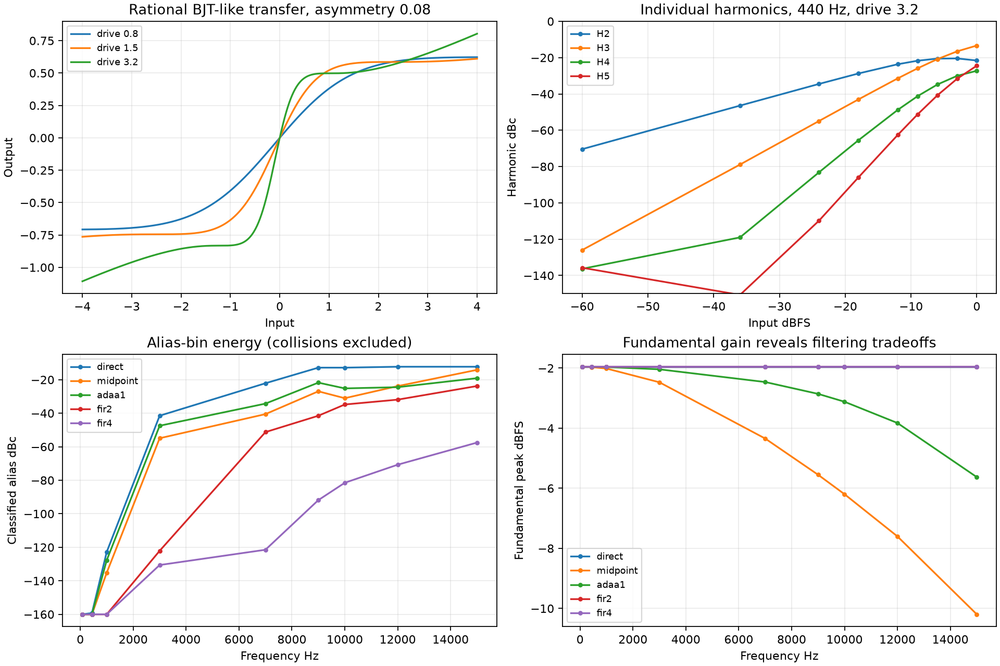

# M3 nonlinear fidelity and antialiasing characterization

## Outcome and scope

The runtime keeps the existing rational transfer and Eco/Standard direct versus
High midpoint processing. No antialias candidate is promoted into the plugin or
MCU. Filtered 4x processing wins the isolated alias measurements, but this FIR
prototype has substantial cost, bandwidth tradeoffs and 64 samples of delay per
nonlinear wrapper. First-order ADAA is inexpensive relative to FIR but attenuates
high-frequency fundamentals and changes harmonics. Neither is a drop-in change
to the existing feedback loop. The literature-based tanh probe changes the
transfer and has no hardware calibration supporting replacement.

M3 adds measurement infrastructure, correct terminology, desktop-only candidate
implementations and independent analysis bypasses. It also fixes callback-size
dependence when nonlinear controls are automated during an active stream. The
historical static/startup control behavior remains intact, preserving baseline
renders exactly. No optical values, phase-stage coefficients/capacitors, feedback
topology, public parameters, UI, Quality labels or factory preset values changed.

## Frozen baseline and nonlinear signal map

Base is `1e010562bf1f23cd5887fdb6ec29691b37b5dcf2`, the M2.1 merge; remote main was
verified at the same commit on 2026-10-07. Baseline captures precede edits.
All twelve factory presets use frozen M0/M1 levels, High, 44.1 kHz, seed 1 and
enabled output conditioning. Reference uses one physical lamp. The separate
LegacyOptical comparison uses the same current audio engine with historical
optics; it is distinct from the old saturation engine.

The complete inventory and classifications are in
[architecture before](m3-nonlinear-architecture-before.md). Per lane:

```
pre HPF -> sum previous profiled feedback -> adaptive BJT-like input curve
-> four grey-box phase cells -> BJT-like output curve -> makeup and clamp
-> tilt and wet LP -> Studio wet/stereo/mono compensation -> dry/wet mix/noise
-> auto level/output gain -> external DC/headroom/rational limiter
```

The feedback tap precedes output shaping: gain/raw clamp -> rational feedback
curve -> post clamp -> envelope limiter -> bounded state -> profile HP/LP/grit.
The old saturation engine also shapes each historical phase stage and clamps
collector histories. Parameter bounds, denormal handling, optical nonlinear
controls and final PCM hard clipping are inventoried separately.

Fresh before/after results:

| Regression | Result |
|---|---|
| SingleLampReference factory renders | 5,232 numerical values unchanged; 96 WAVs byte-identical |
| LegacyOptical factory renders | 5,175 numerical values unchanged; 96 WAVs byte-identical |
| Optical trajectory/calibration CSVs | All 122 non-timing CSVs byte-identical |
| Frozen linear notch trajectory | Byte-identical SHA256 `97513543fed7d6e9855570d23e756c9191123022df4db03af3e1ec4d2b26b6b6` |
| Optical constraints | 60 operating points and four aggregate cell constraints pass |
| Public parameter manifest | IDs/ranges/defaults/units/flags identical to M2.1 |

Raw baseline metrics retain the old column names; comparison scripts normalize
only the explicit HF metric rename. RMS, peak, frequency response, notch tracking,
THD and stereo/mono statistics are retained under
`regression/m3/baseline/{reference,legacy}/factory_*/metrics`. Numerical comparisons,
WAV hashes and configuration accompany them. Full WAV captures remain in ignored
`build/m3/{before,after}` rather than adding audio binaries to Git.

## Current transfer characteristic

Let `f(z)=z(27+z²)/(27+9z²)`, `a=.84*drive`, `b=asymmetry*drive`, and
`g=BJTGainTrim*SatOutTrim`. The nonlegacy transfer is

```
y(x) = g * [f(a*x+b) - f(b)]
f(z) = z/9 + (8/3)*z/(z*z+3)
f'(z) = (z*z-9)^2 / [9*(z*z+3)^2]
```

The small-signal gain is `g*a*f'(b)`. The rational curve is odd without bias;
bias breaks odd symmetry and produces even harmonics. Subtracting `f(b)` gives
exact zero at zero input with fixed or automated bias, but does not cancel the
mean generated by asymmetric AC. The curve passes through +/-1 at +/-3 and has
zero derivative there. At larger magnitudes it resumes growth asymptotically
with slope 1/9. It is neither a cubic polynomial nor a globally bounded limiter.
The flat region/knee shifts with drive and bias; runtime drive/envelopes and
subsequent clamps determine practical headroom.

`transfer.csv` exports input/output, central-difference derivative, local gain and
the tanh comparison for drives .8/1.5/3.2, asymmetries -.25/0/.08/.25 and input
-4..4 in .01 increments (9,612 points). All wrappers agree at settled DC within
2e-6, including FIR passband gain. Actual core Eco/Standard/High probes match the
analyzer's direct/midpoint implementations within 2e-7.

## Measurement methodology

`nonlinear_analyze` is a standalone C++17 executable; no Python or heap allocation
is used in candidate sample processing. Allocations for FFTs/captures occur outside
those loops. The matrix has 5,832 static sine captures: both BJT-like and rational
limiter stages; six algorithms; 44.1/48/96/192 kHz; levels -60/-36/-24/-18/-12/-9/
-6/-3/0 dBFS; nominal 80/440/1000/3000/7000/9000/10000/12000/15000 Hz. BJT probes
use drive 1.5 and 3.2, bias .08 and gain/trim .70/.95. The plain rational limiter
has unity drive/no bias; gain labels are explicit in the CSV.

Each frequency is rounded to the closest FFT bin; both requested and actual
frequency are exported. Captures have 32,768 steady samples after 8,192 warmup
samples. The window is periodic Hann. The bin exclusion/integration width is
two bins on either side; DC bins 0..2 and fundamental bins are removed from the
residual. The positive-frequency Hann energy normalization is `16/(3*N*N)`;
peak-amplitude harmonic levels use twice that energy. A synthetic calibration
test verifies fundamental, H2 and a known folded harmonic independently. No
FFT-band-above-12-kHz metric is used as an alias measure.

For sine input, harmonic orders 1..128 are classified. Orders below Nyquist are
legitimate harmonic bins; higher orders fold modulo Fs and reflect around
Nyquist. Alias energy integrates the union of folded bins after excluding all
legitimate harmonic bins. Alias dBc uses fundamental energy; alias dBFS is RMS.
Worst alias integrates a five-bin tone neighborhood. Overlapping classifications
are counted in `collision_bins` and excluded from alias attribution, making the
result a lower bound in collision cases. H2..H5 above Nyquist are `nan` (not zero
distortion); THD includes only in-band harmonics. In-band harmonic measurements
can also contain inseparable colliding aliases. Unclassified residual includes
numerical floor and products above the classification order; it is not a pure
noise measurement. Values floored to -300 dB indicate zero/below numerical floor,
not a validated physical noise floor.

The deterministic multitone uses coherent tones near 7103/9973/13109 Hz with
fixed phases `0,.37,.74` and per-tone amplitude .8/3. Signed frequency combinations
through total order seven classify legitimate in-band IMD and folded products,
excluding collision bins and fundamentals. A separate analytic-input 16x render
uses the same float transfer and yields a numerical bandlimited comparator.
The reported reference residual compares spectral **magnitudes**, not aligned
time-domain signals. It reveals missing/attenuated legitimate products as well
as alias contamination; it is not a circuit/hardware ground truth. At other rates
classification collisions are explicitly reported.

The old whole-effect metric remains for historical comparisons as
`broadband_hf_db`, `guitar_broadband_hf_db`, `sweep_broadband_hf_db`; its scoring
weight is unchanged. It measures broadband energy above 12 kHz and is explicitly
not evidence of aliasing in a time-varying effect.



## Transistor-model investigation and candidate rationale

The original phase stages use Darlington buffering followed by collector/emitter
phase splitting; the first stage differs. DAFx-19 reports asymmetric clipping and
models it with biased/scaled tanh, using measurement plus heuristic tuning.
Its small-signal phase-network model does not establish nonlinear parameters for
this implementation. The desktop `tanh_reference` uses the same bias subtraction,
drive, headroom and gain/trim as the current transfer; it is a literature-based
memoryless comparison, not a physical transistor model. Its low-frequency null
and harmonic changes reject automatic replacement. See
[DAFx-19](https://www.dafx.de/paper-archive/2019/DAFx2019_paper_31.pdf).

An Ebers-Moll mapping would require DC operating point, transistor parameters,
supply/load/emitter degeneration and measured audio-to-voltage scaling. Those
are not established here. A circuit-derived polynomial/rational fit therefore
has no defensible target dataset yet. Newton/WDF and full circuit-memory models
are deferred because no measurements demonstrate a material advantage over the
existing phase-network behavior. No fitted transistor coefficients or claimed
hardware ground truth were invented.

## ADAA derivation and numerical safeguards

First-order antiderivative antialiasing is evaluated for the memoryless rational
function and biased/scaled BJT-like transfer. It follows the antiderivative
framework described by [Bilbao, Esqueda, Parker and Välimäki](https://www.research.ed.ac.uk/en/publications/antiderivative-antialiasing-for-memoryless-nonlinearities/).
For these specific equations, the derivation used here is:

```
F(z) = z*z/18 + (4/3)*log1p(z*z/3)
G(x) = g * [(F(a*x+b)-F(b))/a - f(b)*x]
y[n] = (G(x[n])-G(x[n-1])) / (x[n]-x[n-1])
```

Double-precision primitives use `log1p`. If the input difference is below
`1e-5*(1+max(abs(x),abs(previous)))`, evaluation falls back to the current
transfer at the midpoint. Initialization evaluates the direct curve; reset
clears history deterministically. Both endpoints use the **current** parameters
when controls change, avoiding subtraction between different functions. Tests
differentiate the primitive numerically, cover equal/near-equal inputs, silence,
biased DC, asymmetry extremes, transients and automation. No NaN/Inf occurs in
tested domains. The analytic primitive describes the ideal rational equation;
the direct/fallback probes intentionally use production float arithmetic.

ADAA is not applied to envelopes, headroom, stateful profile filters, optical
control or the feedback loop as a whole. Its first-order near-linear response
has half-sample delay and frequency-dependent attenuation; this tradeoff is
measured rather than treated as neutral tone.

## True oversampling architecture

`Fir2`/`Fir4` perform zero-insertion interpolation using polyphase FIR evaluation,
evaluate the unchanged transfer at the elevated rate, then low-pass and decimate.
Both filters are Blackman-windowed sinc with cutoff `.46*baseFs`, unity DC gain;
interpolation phases have factor compensation. Tap counts are 129 at 2x and 257
at 4x. Each filter delays 32 base-rate samples; total measured/designed delay is
64 samples (1.451 ms at 44.1 kHz). Fixed arrays hold coefficients/histories; no
audio-loop allocation occurs. Initialization/reset clears all histories.

`filters.csv` records frequency responses: the two-filter linear chain is about
-0.012 dB at .42 Fs, -12.04 dB at .46 Fs, -43.39 dB at .48 Fs, and -126.63 dB at
.50 Fs for 2x. Nonlinear products encounter only the decimation filter, so those
two-filter stopband figures must not be mistaken for nonlinear alias rejection.
This deliberately conservative prototype sacrifices upper-edge bandwidth.
It is a desktop experiment, not a low-latency production oversampling subsystem.
Inserting it into the existing feedback tap would alter loop phase and requires
separate validation/host latency treatment.

## Measured results

### Harmonic results

BJT probe: asymmetry 0.08, gain trim 0.70, output trim 0.95, coherent frequency near 440 Hz at 44.1 kHz. Harmonics are peak dBFS; THD is dBc. These are representative isolated settings, not complete factory renders.

| Drive | Input dBFS | H1 | H2 | H3 | H4 | H5 | THD |
|---|---|---|---|---|---|---|---|
| 1.5 | -24 | -25.66 | -73.16 | -92.57 | -134.45 | -158.50 | -47.45 |
| 1.5 | -12 | -13.83 | -49.60 | -56.89 | -87.00 | -99.06 | -35.02 |
| 1.5 | -6 | -8.35 | -38.91 | -39.85 | -64.65 | -70.38 | -27.99 |
| 1.5 | 0 | -4.04 | -31.26 | -25.12 | -46.19 | -44.92 | -20.07 |
| 3.2 | -24 | -19.50 | -54.00 | -74.43 | -102.70 | -129.35 | -34.46 |
| 3.2 | -12 | -8.16 | -31.79 | -39.55 | -56.89 | -70.67 | -22.94 |
| 3.2 | -6 | -3.90 | -24.43 | -24.73 | -38.72 | -44.68 | -17.56 |
| 3.2 | 0 | -1.95 | -23.54 | -15.29 | -29.20 | -26.39 | -12.26 |

### High-frequency sine results

BJT probe: 44.1 kHz, drive 3.2, input 0 dBFS. Alias energy is relative to the fundamental; aliases colliding with legitimate harmonics are excluded.

| Requested Hz | Algorithm | H1 dBFS | Alias dBc | Worst alias RMS dBFS |
|---|---|---|---|---|
| 7000 | direct | -1.95 | -22.11 | -29.40 |
| 7000 | midpoint | -4.34 | -40.53 | -49.05 |
| 7000 | adaa1 | -2.46 | -34.27 | -40.65 |
| 7000 | fir2 | -1.95 | -51.27 | -57.46 |
| 7000 | fir4 | -1.95 | -121.48 | -129.59 |
| 15000 | direct | -1.95 | -12.26 | -18.30 |
| 15000 | midpoint | -10.19 | -14.12 | -27.60 |
| 15000 | adaa1 | -5.63 | -19.07 | -28.04 |
| 15000 | fir2 | -1.95 | -23.77 | -29.40 |
| 15000 | fir4 | -1.95 | -57.52 | -64.61 |

### Multitone results

BJT probe: 44.1 kHz, drive 3.2, three upper-band coherent tones, composite peak bounded by 0.8. Values are RMS dBFS; no collision bins at this rate.

| Algorithm | In-band IMD | Classified alias | Unclassified residual | 16x magnitude residual |
|---|---|---|---|---|
| direct | -22.75 | -26.24 | -58.83 | -26.24 |
| midpoint | -27.74 | -44.49 | -68.23 | -15.07 |
| adaa1 | -26.21 | -38.99 | -71.60 | -20.34 |
| fir2 | -23.00 | -60.29 | -61.72 | -39.97 |
| fir4 | -23.00 | -106.28 | -64.90 | -40.02 |
| tanh_reference | -22.79 | -26.24 | -56.31 | -26.13 |

### Candidate cost and low-frequency null

Desktop single-stage timing includes candidate dispatch; it is not RP2350 timing. Fixed analysis objects reserve FIR storage for every mode. Active payload storage is listed separately (ADAA/midpoint counts exclude padding); FIR storage includes coefficients.

| Algorithm | ns/sample | Active bytes | Reserved object bytes | Delay samples | 79.4 Hz null dBc |
|---|---|---|---|---|---|
| direct | 8.5 | 0 | 4728 | 0 | -300.00 |
| midpoint | 20.7 | 25 | 4728 | 0.888889 | -94.75 |
| adaa1 | 76.1 | 25 | 4728 | 0.5 | -110.03 |
| fir2 | 399.2 | 4648 | 4728 | 64 | -141.39 |
| fir4 | 795.7 | 4648 | 4728 | 64 | -141.96 |
| tanh_reference | 15.5 | 0 | 4728 | 0 | -46.43 |

## Selection, Quality consistency and platform strategy

At 7 kHz the filtered 4x probe dramatically reduces classified alias energy with
essentially unchanged fundamental; at 15 kHz it still improves on direct by
about 45 dB. Midpoint smoothing substantially lowers multitone alias energy but
also suppresses desired products; its 15 kHz fundamental is approximately 8.24 dB
below direct. ADAA's 15 kHz fundamental drops about 3.68 dB and its in-band IMD
balance differs. These are meaningful tonal tradeoffs even when low-frequency
DC transfers agree. The conservative FIR's residual near the Nyquist edge also
includes attenuated legitimate products. Its single-stage cost is orders above
direct and its latency would compound at multiple wrappers.

Therefore the selected shipping implementation remains the existing transfer
and Quality mapping. Eco/Standard are direct; High is midpoint plus its existing
wet filtering/coefficient cadence. Static settled transfer consistency, actual
core-probe parity and aligned low-frequency nulls pass. The inherited high-band
Quality differences are quantitatively documented, not claimed solved. No new
public nonlinear mode/parameter is introduced. Desktop tools use an internal
Mode enum with Direct/Midpoint/ADAA/Fir2/Fir4/TanhReference.

MCU, WASM and VST currently share the same runtime transfer and midpoint strategy.
Only desktop analyzers include the new double/log/FIR candidates; there is no
intentional shipping sonic divergence yet. A later minimum-phase/polyphase
desktop implementation could share the transfer with a lightweight MCU strategy,
but that decision needs low-delay full-loop tests and listening first.

## Safety isolation, DC and automation

Desktop `dsp_validate` provides independent `--no-output-limiter`,
`--no-output-headroom`, `--no-final-conditioning`, `--no-wet-compensation` and
`--no-auto-level`. Internal core bypass members compile only with
`VIBE_DESKTOP_ANALYSIS`; production wrappers do not expose them. Static probes
bypass the entire effect/conditioner. Essential feedback/stage/finite bounds are
retained, including when desktop conditioning is disabled. The combined bypass
factory render is recorded in `diagnostic-bypass.log`.

Bias subtraction maintains zero output on silence for all candidates even with
alternating extreme asymmetry. Constant/near-silent input, +/- bias, resets and
step changes are finite. `transients.csv` reports peak, static endpoint peak,
overshoot and maximum sample delta for both transfers, all candidates, three
drives and three biases; maximum measured FIR step overshoot is approximately
0.0257 while direct/midpoint/ADAA have no endpoint overshoot in this matrix. In three biased-input ADAA examples, DC before the
existing 8 Hz blocker is approximately .241/.183/.108; after settling its
one-second mean is below 5e-7. Silence invariants for active/frozen/no-feedback
cores and the output-conditioner tests also pass. Existing AC coupling/DC
conditioning remain responsible for generated signal DC; no claim is made that
the bias subtraction alone removes AC-generated mean or DC in every feedback
node under every signal.

An abrupt/ramped 256-sample event schedule changes Input Drive, Feedback, Sat
Asymmetry and Sat Out Trim across their ranges. Initial targets are applied at
reset. Processing with 32 versus 7 sample blocks gives exactly zero output
difference in Eco/Standard/High. Once a target changes during an active stream,
these four controls use a per-sample one-pole with the existing control-smoothing
rate. This persists until reset; static/startup renders retain the original
block ramps. No unrelated smoothing was introduced. Reported sample-step bounds
test numerical discontinuities; they are **not** a subjective guarantee of
inaudible clicks. Candidate parameter automation also stays finite and silence
remains zero. Stateful FIR parameter modulation is an experiment, not claimed
equivalent to constant-parameter ADAA mathematics.

## CPU, memory and build verification

Candidate costs/state are in the measured table and `cpu.csv`. Full-core
before/after comparisons use the same compiler, `-O3 -DNDEBUG`, seed and benchmark
source, three alternating runs. Timing CSVs retain means/maxima/checksums;
desktop scheduling and CPU frequency variation prevent an MCU deadline claim.
Three-run core timing medians (ns/stereo frame) are retained below; wide run
ranges, including large scheduler maxima, make small speedup/regression claims
unjustified. All benchmark checksums agree before/after.

| Optics | Quality | Before median ns | After median ns |
|---|---|---|---|
| Legacy | Eco | 724.0 | 642.6 |
| Legacy | Standard | 763.2 | 665.0 |
| Legacy | High | 1247.0 | 1134.4 |
| Reference | Eco | 644.3 | 658.4 |
| Reference | Standard | 695.4 | 669.5 |
| Reference | High | 1272.7 | 1206.3 |

The production build reserves no candidate FIR/log state. On this host ABI,
`sizeof(Vibe)` increases from 6,152 to 6,168 bytes (+16) for automation targets and
mode state; analysis-enabled builds are 6,176 bytes. OpticalModel remains 1,816
bytes. The inactive static path adds target comparisons and a branch; active
automation adds four sample-clock smoothers. RP2350 cycle cost remains unmeasured.

| Check | Final result |
|---|---|
| C++ desktop build | Pass, including analyzer and candidates |
| Core CTest | 10/10 pass, including FFT calibration/classification and nonlinear validation |
| Nonlinear measurement validation | Complete matrices, finite values, harmonic classification, gain/null/alias improvements and exact regressions pass |
| Optical validation | All operating point / DAFx aggregate checks pass |
| Fresh Reference/Legacy/notch regressions | Exact as detailed above |
| JUCE smoke | Pass, rates 44.1/48/96/192 kHz, mono/stereo, presets, automation and blocks |
| pluginval 1.0.4 | SUCCESS, strictness 8, seed 0x7f78bbf, GUI tests skipped, exit 0 |
| WASM | C++17 -O3, complete production export list, exit 0 |
| RP2350 | pico2 / rp2350-arm-s, existing SDK/toolchain, ELF/UF2, exit 0 |
| Parameter contract | Exact M2.1 manifest match |

Existing factory loudness ratio remains 1.61783, outside the deferred mastering
criterion. No preset gain was changed to hide it. Logs and CSVs are under
`docs/regression/m3`. pluginval uses hidden `Start-Process -Wait` with captured
stdout/stderr on Windows; a bare PowerShell invocation can return without useful
output and is not used as validation evidence.

## Reproduction

```powershell
cmake -S desktop_tools -B build/desktop_tools -G Ninja -DCMAKE_BUILD_TYPE=Release
cmake --build build/desktop_tools --parallel 4
ctest --test-dir build/desktop_tools --output-on-failure
build/desktop_tools/nonlinear_test.exe docs/regression/m3/numerical.csv
build/desktop_tools/nonlinear_analyze.exe docs/regression/m3
python desktop_tools/scripts/summarize_nonlinear.py docs/regression/m3
python desktop_tools/scripts/validate_nonlinear.py docs/regression/m3
python desktop_tools/scripts/plot_nonlinear.py docs/regression/m3

$factoryArgs = 0..11 | ForEach-Object { '--preset'; "factory_$_" }
build/desktop_tools/dsp_validate.exe --out-dir build/m3/reference --quality high --optical reference --topology reference --factory-levels baseline @factoryArgs
build/desktop_tools/dsp_validate.exe --out-dir build/m3/legacy --quality high --optical legacy @factoryArgs
build/desktop_tools/notch_trajectory.exe build/m3/notches.csv
build/desktop_tools/optical_analyze.exe --out-dir build/m3/optics
python desktop_tools/scripts/validate_optical.py build/m3/optics/summary.csv
```

For fresh pre-edit captures, build the desktop tools from the identified main
commit into a separate directory before building this branch. Use
`compare_regression.py BEFORE AFTER OUTPUT` on both topology captures; the script
accepts the historical and renamed HF column names. JUCE, firmware and WASM use
the same build paths/flags documented in the M2.1 report; the final logs capture
these builds against the final M3 core. Plotting uses numpy/matplotlib only.

## Files and remaining uncertainty

Changed core files: `vibe_core.hpp` (terminology, internal bypass/probe, automation)
and new `nonlinear_transfer.hpp` (identical shared curve arithmetic).
Desktop additions: `nonlinear_candidates.hpp`, `nonlinear_analyze.cpp`,
`nonlinear_test.cpp`, plotting/summary/validation scripts. Updated desktop CMake, processor
analysis switches, full-effect metric names, comparison-script schema migration,
README and the two M3 documents; regression evidence is under `regression/m3`.

No real-unit transistor measurements, calibrated voltage mapping, subjective
level-matched listening, on-device cycle profiling, hosted CI or GUI validation
were performed. Finite-order spectral masks cannot identify aliases that coincide
with legitimate components; multitone residual is not pure noise. The reference
is numerical and still uses production float transfer precision. Static-stage
improvements do not prove full-effect feedback stability or perceptual benefit.

Recommended next milestone: build and validate a low-delay desktop antialias
implementation with the preserved transfer; compare full feedback-loop response,
host latency, automation and level-matched listening, and measure RP2350 cycles.
Acquire actual stage voltages/transfers before pursuing a transistor fit. UI
redesign, factory mastering and release packaging remain separate work.
